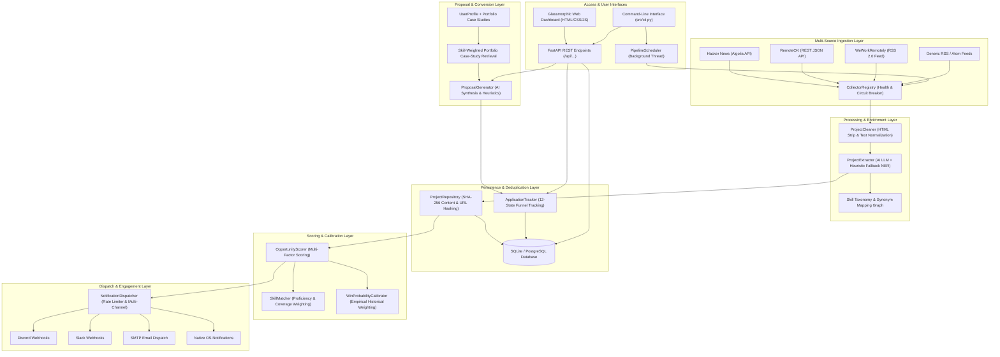
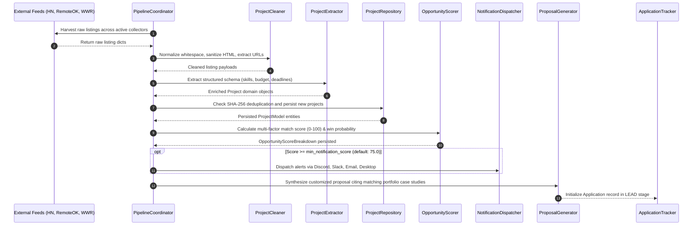
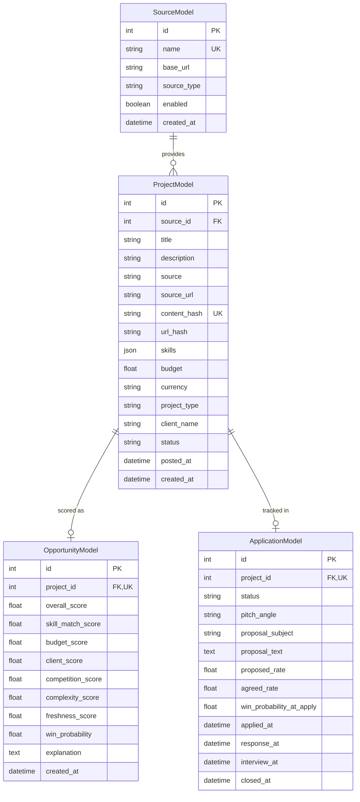

# CLIENT FINDER SVC — System Architecture & Technical Design Document

## 1. Executive Summary

**CLIENT FINDER SVC** is an automated, AI-powered freelance opportunity discovery, scoring, and context-aware proposal generation platform. Built in Python 3.12+ with FastAPI, SQLAlchemy 2.0, Pydantic v2, and modern LLM integrations, it continuously monitors remote work platforms and developer communities, extracts structured project requirements, evaluates compatibility against developer skill profiles, ranks leads with explainable multi-factor scoring, and synthesizes tailored proposals citing relevant past case studies.

---

## 2. High-Level System Architecture



---

## 3. End-to-End Opportunity Lifecycle

The platform executes an 8-stage automated workflow from raw remote feed ingestion to client conversion:



---

## 4. Module Directory & Architectural Responsibilities

The codebase follows a clean, modular layer architecture located in `src/`:

| Package | Purpose & Key Components |
| :--- | :--- |
| `src/ai/` | LLM client abstractions (`BaseLLMClient`, `OpenAILLMClient`, `GeminiLLMClient`, `OllamaLLMClient`), prompt builders, and structured Pydantic extraction schemas (`ExtractedRequirements`). |
| `src/analytics/` | Conversion funnel analytics (`AnalyticsEngine`), velocity tracking, pitch-angle win rate analysis, and empirical Bayesian learning calibration (`WinProbabilityCalibrator`). |
| `src/api/` | FastAPI REST application (`src/api/main.py`), 11 modular route routers (`/api/projects`, `/api/opportunities`, `/api/proposals`, `/api/collectors`, etc.), and glassmorphic static single-page web dashboard (`src/api/static/`). |
| `src/collectors/` | External platform harvesters (`HackerNewsCollector`, `RemoteOKCollector`, `WeWorkRemotelyCollector`, `RSSFeedCollector`), and the centralized `CollectorRegistry` with health telemetry and circuit breaker protection. |
| `src/database/` | Database engine management (`src/database/connection.py`), SQLAlchemy ORM declarative models (`ProjectModel`, `OpportunityModel`, `SourceModel`, `ApplicationModel`), and CRUD repositories. |
| `src/matching/` | Skill matching engine (`SkillMatcher`), hierarchical synonym taxonomy graph (`src/matching/taxonomy.py`), and explainable match result generators. |
| `src/models/` | Core domain entities: `Project`, `UserProfile`, `SkillProficiency`, `PortfolioProject`, and default profile factories. |
| `src/notifications/`| Multi-channel dispatcher (`NotificationDispatcher`), token-bucket rate limiter, and channel adapters (`DiscordNotifier`, `SlackNotifier`, `EmailNotifier`, `DesktopNotifier`). |
| `src/processors/` | Data cleaning and text normalization utilities (`ProjectCleaner`, `clean_project_data`, `extract_urls`, `clean_whitespace`). |
| `src/proposal/` | Context-aware AI proposal synthesis (`ProposalGenerator`), deterministic offline heuristic generator (`HeuristicProposalGenerator`), pitch angle selection, and prompt engineering. |
| `src/scheduler/` | Orchestration coordinator (`PipelineCoordinator`) and autonomous background daemon thread (`PipelineScheduler`). |
| `src/scoring/` | Multi-factor opportunity scoring algorithms (`OpportunityScorer`, budget scoring, client credibility scoring, competition scoring, freshness scoring). |
| `src/tracking/` | 12-state application lifecycle state machine (`ApplicationTracker`, `ApplicationStatus`), timestamp progression, and outcome persistence. |
| `src/utils/` | Shared utilities: robust retry-enabled HTTP client (`HttpClient`), currency conversion, date parsers, and custom logging formatters. |

---

## 5. Database Schema & Data Models

The relational persistence layer uses SQLAlchemy 2.0 ORM with support for SQLite and PostgreSQL:



---

## 6. Multi-Source Harvester & Circuit Breaker Pattern

To guarantee uninterrupted ingestion even when third-party feeds experience rate limits or network outages, the `CollectorRegistry` implements an autonomous circuit breaker:

- **Health Telemetry**: Tracks `success_count`, `failure_count`, `consecutive_failures`, `total_items_collected`, and `last_scrape_at`.
- **Tripping Condition**: When `consecutive_failures >= failure_threshold` (default: 3), the circuit transitions to `circuit_broken = True`.
- **Isolation**: Broken collectors are automatically bypassed during pipeline cycles without aborting other sources.
- **Recovery**: Manual reset via REST endpoint `POST /api/collectors/{source}/reset-circuit` or automated reset on next explicit invocation.

---

## 7. Opportunity Scoring Engine & Mathematical Formulation

The `OpportunityScorer` computes an explainable composite score $S \in [0, 100]$:

$$S = w_s S_{\text{skill}} + w_b S_{\text{budget}} + w_{cl} S_{\text{client}} + w_{cp} S_{\text{comp}} + w_x S_{\text{compld}} + w_f S_{\text{fresh}}$$

Where weights $\sum w_i = 1.0$:
- $w_s = 0.35$ (Skill Match & Proficiency Score)
- $w_b = 0.20$ (Budget & Compensation Score)
- $w_{cl} = 0.15$ (Client Credibility & Risk Score)
- $w_{cp} = 0.10$ (Competition & Applicant Pressure Score)
- $w_x = 0.10$ (Technical Complexity Fit Score)
- $w_f = 0.10$ (Freshness & Recency Decay Score)

### Win Probability Calculation ($P_{\text{win}}$)

$$P_{\text{win}} = \text{clamp}\left(0.5 \cdot \frac{S_{\text{skill}}}{100} + 0.3 \cdot \frac{S_{\text{budget}}}{100} + 0.2 \cdot \frac{S_{\text{comp}}}{100}, 0.05, 0.95\right) \times M_{\text{skill}} \times M_{\text{pitch}}$$

Where $M_{\text{skill}} \in [0.5, 2.0]$ and $M_{\text{pitch}} \in [0.7, 1.5]$ are empirical learning calibration multipliers derived from historical proposal win rates.

---

## 8. Portfolio Case-Study RAG & Proposal Generator

When generating proposals, the system executes dynamic Retrieval-Augmented Generation (RAG) against the developer's verified portfolio:

1. **Relevance Ranking**: Opportunity target skills are matched against `PortfolioProject.technologies` and project descriptions.
2. **Context Injection**: Top $N$ matching case studies (including quantitative business achievements) are formatted into the prompt.
3. **Strategic Pitch Angles**: The engine dynamically recommends the optimal angle based on opportunity signals:
   - `TECHNICAL_EXPERT`: Deep architecture, type safety, performance, and scaling patterns.
   - `FAST_DELIVERY`: Rapid execution, MVP milestone roadmap, immediate availability.
   - `VALUE_ROI`: Business outcome optimization, infrastructure cost reduction, revenue velocity.
   - `PORTFOLIO_PROOF`: Heavy citation of past case studies and live demo links.
   - `CONSULTATIVE_ADVISOR`: Architectural discovery, trade-off analysis, roadmap scoping.

---

## 9. REST API Endpoint Catalog

| Route Group | Path | Method | Description |
| :--- | :--- | :--- | :--- |
| **System** | `/health` | `GET` | Service operational health and uptime |
| **Projects** | `/api/projects` | `GET` | Paginated project opportunities with score filtering |
| **Projects** | `/api/projects/{id}` | `GET` | Single project detail with score breakdown |
| **Projects** | `/api/projects/{id}/status` | `PUT` | Update review status (`NEW`, `REVIEWED`, `APPLIED`, `ARCHIVED`) |
| **Search** | `/api/search` | `GET` | Full-text query across title, description, skills, and client |
| **Opportunities** | `/api/opportunities` | `GET` | Opportunities ranked by overall match score |
| **Opportunities** | `/api/opportunities/stats` | `GET` | Lead volume, tier breakdown, and score distribution |
| **Proposals** | `/api/proposals/generate` | `POST` | Synthesize customized AI proposal with portfolio RAG |
| **Profile** | `/api/profile` | `GET` / `PUT` | Inspect or update active developer capabilities and portfolio |
| **Collectors** | `/api/collectors` | `GET` | List all registered collector sources and health states |
| **Collectors** | `/api/collectors/health` | `GET` | Detailed telemetry, success rates, and circuit status |
| **Collectors** | `/api/collectors/{source}/toggle` | `POST` | Enable or disable a specific source collector |
| **Collectors** | `/api/collectors/{source}/reset-circuit` | `POST` | Reset a tripped circuit breaker |
| **Collectors** | `/api/collectors/collect` | `POST` | Trigger immediate collection across single or all sources |
| **Notifications**| `/api/notifications/test` | `POST` | Send test notification payload to configured channels |
| **Scheduler** | `/api/scheduler/status` | `GET` | Background scheduler status and interval telemetry |
| **Scheduler** | `/api/scheduler/trigger` | `POST` | Trigger immediate background harvest cycle |
| **Scheduler** | `/api/scheduler/pause` | `POST` | Temporarily pause automated recurring cycles |
| **Scheduler** | `/api/scheduler/resume` | `POST` | Resume recurring background harvest cycles |
| **Applications** | `/api/applications` | `GET` / `POST` | List and create tracked proposal applications |
| **Applications** | `/api/applications/{id}/status` | `PUT` | Progress application through 12 lifecycle stages |
| **Analytics** | `/api/analytics/funnel` | `GET` | Conversion funnel drop-off rates and metrics |
| **Analytics** | `/api/analytics/insights` | `GET` | AI-generated conversion velocity and pitch insights |
| **Real-Time** | `/api/ws/events` | `WebSocket` | Bi-directional live stream of discovery, scoring, and lifecycle events |
| **Real-Time** | `/api/events/stream` | `GET` | Server-Sent Events (SSE) fallback event stream |
| **Collectors** | `/api/collectors/custom` | `POST` | Dynamically verify, persist, and register arbitrary RSS/Atom feed |
| **Collectors** | `/api/collectors/custom/{source}` | `DELETE` | Unregister and remove dynamic custom source |
| **Export** | `/api/export/csv` | `GET` | Download RFC 4180 CSV spreadsheet of scored opportunities |
| **Export** | `/api/export/json` | `GET` | Download formatted JSON dump of opportunity records |
| **Export** | `/api/export/proposals/{id}/markdown` | `GET` | Download standalone proposal formatted in GitHub Markdown |
| **Integrations** | `/api/integrations/webhooks` | `GET` / `POST` | Manage outbound HMAC-SHA256 authenticated webhook targets |
| **Integrations** | `/api/integrations/webhooks/test` | `POST` | Dispatch test payload to verify target webhook reception |

---

## 10. CLI Command Reference

The command-line interface (`src/cli.py`) provides full terminal control:

```bash
# Execute immediate multi-source harvest cycle
python -m src.cli harvest --min-score 75 --limit 15

# View top ranked opportunities in terminal
python -m src.cli list --limit 10 --min-score 70

# Synthesize proposal for a specific project
python -m src.cli propose 42 --angle TECHNICAL_EXPERT --pricing

# Track an application
python -m src.cli apply 42 --angle TECHNICAL_EXPERT --rate 95.0

# Inspect application conversion funnel analytics
python -m src.cli funnel

# Start autonomous background scheduler daemon
python -m src.cli daemon --interval 60
```
