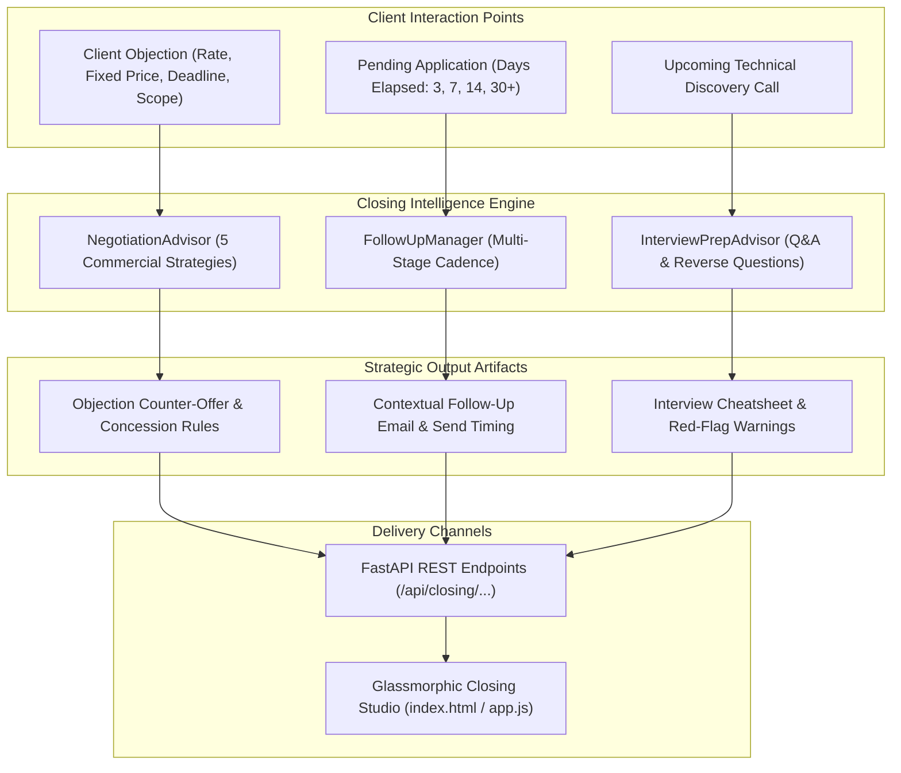

# AI Client Negotiation, Follow-Up & Technical Interview Prep Studio

## Executive Summary

Phase 14 completes the client acquisition and conversion lifecycle by equipping developers with an AI-driven **Negotiation, Follow-Up, and Technical Interview Prep Studio**:
1. **AI Objection Counter-Offer Engine (`NegotiationAdvisor`)**: Synthesizes high-conversion commercial scripts and structured counter-proposals for common client pushbacks (*Rate too high*, *Requesting fixed price*, *Tight turnaround*, *Scope ambiguity*) across 5 proven commercial strategies (`VALUE_ANCHORING`, `SCOPE_MODULATION`, `MILESTONE_SPLIT`, `DISCOUNT_FOR_TERM`, `DEPOSIT_RETAINER`).
2. **Automated Follow-Up Cadence Manager (`FollowUpManager`)**: Synthesizes context-aware, non-intrusive follow-up messages tailored to the elapsed time since application (`DAY_3_CHECKIN`, `DAY_7_VALUE_ADD`, `DAY_14_BREAKUP`, `REVIVE_COLD_LEAD`).
3. **Technical Interview Preparation Assistant (`InterviewPrepAdvisor`)**: Analyzes the target opportunity requirements and generates likely architectural questions, model answers citing verified portfolio proofs, and strategic reverse questions to ask the client.
4. **Interactive Closing Studio Web UI**: A dedicated "💬 Closing Studio" modal in the Glassmorphic Web Dashboard with instant copyable scripts and interview prep cards.

---

## 1. Closing & Negotiation Architecture

---

## 2. Component Breakdown

### 2.1 AI Objection Handling Engine (`src/proposal/negotiation.py`)
- **Supported Objection Types**:
  - `RATE_TOO_HIGH`: Budget constraints or rate pushback.
  - `FIXED_PRICE_REQUEST`: Client requesting fixed-price milestone instead of hourly billing.
  - `TIGHT_DEADLINE`: Urgent, compressed turnaround requests.
  - `SCOPE_UNCERTAINTY`: Unclear or evolving requirements.
  - `COMPETITOR_COMPARISON`: Comparison with cheaper offshore alternatives.
- **5 Negotiation Strategies**:
  - `VALUE_ANCHORING`: Anchors on business ROI and senior code quality; proposes an exploratory 10-hour milestone.
  - `SCOPE_MODULATION`: Trims non-critical features to fit the exact budget into Phase 1 without discounting the hourly rate.
  - `DISCOUNT_FOR_TERM`: Offers a 10% volume discount for guaranteed 2-month retainer commitments.
  - `MILESTONE_SPLIT`: 3-phase escrow structure with 33% upfront commitment.
  - `DEPOSIT_RETAINER`: 50% upfront escrow deposit with formal Change Order protocols.

### 2.2 Follow-Up & Re-engagement Cadence Manager (`src/proposal/followup.py`)
- **Cadence Stages**:
  - `DAY_3_CHECKIN`: Soft touch confirming receipt with calendar availability reservation.
  - `DAY_7_VALUE_ADD`: Unsolicited architectural concept and offer for a quick Loom video walkthrough.
  - `DAY_14_BREAKUP`: Reverse-psychology closing loop email that prompts action from busy founders.
  - `REVIVE_COLD_LEAD`: Re-engagement email for 30+ day old leads citing recent case studies and performance metrics.

### 2.3 Technical Interview Preparation Assistant (`src/proposal/interview_prep.py`)
- **Synthesized Briefing Sheet**:
  - **Architecture Overview**: High-level breakdown of the stack and modular patterns.
  - **Anticipated Questions & Model Answers**: Deep dives into Async queues, SHA-256 idempotency, and Pydantic validation fallbacks.
  - **Reverse Questions to Ask Client**: Evaluates decision-making hierarchy, legacy system constraints, and deployment environments.
  - **Red-Flag Warnings**: Identifies potential scope creep, unrealistic timelines, or absence of milestone criteria.

---

## 3. REST API Endpoint Reference Catalog

| Route Group | Method | Path | Description |
| :--- | :--- | :--- | :--- |
| **Closing** | `POST` | `/api/closing/negotiate` | Synthesize objection counter-offers, scripts, and concession rules |
| **Closing** | `POST` | `/api/closing/followup` | Generate timed follow-up messages across 4 cadence stages |
| **Closing** | `POST` | `/api/closing/interview-prep` | Generate technical interview questions, model answers, and reverse questions |
| **Closing** | `POST` | `/api/closing/from-application/{id}/followup` | Generate follow-up message directly from a tracked application ID |

---

## 4. Verification & Quality Assurance

- **Unit Tests**: 204/204 unit tests passing (100% pass rate across entire suite).
- **Linter & Formatter**: 100% clean Ruff check and format pass across 124 files.
- **Static Type Checking**: 0 mypy errors across all 87 source modules.
