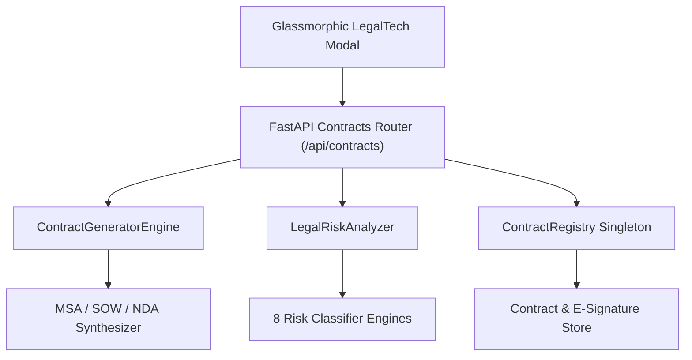

# Phase 25: AI Contract Generator & Legal Risk Analyzer (LegalTech Studio)

## Overview
Phase 25 introduces **AI Contract Generator & Legal Risk Analyzer** to `CLIENT FINDER SVC`. Designed for freelancers, technical consultants, and independent agencies, this module provides automated contract synthesis (MSAs, SOWs, NDAs, Contractor Agreements) and an AI Legal Auditor that inspects client-provided contracts to flag legal traps, indemnification liabilities, unfavorable payment terms, and IP ownership risks.

---

## Key Capabilities

1. **Automated Legal Contract Generator**
   - Synthesizes professional, protective agreements:
     - **MSA (Master Services Agreement)**: General terms, payment provisions, IP protection, liability caps, and termination notice rules.
     - **SOW (Statement of Work)**: Deliverable scope, phase breakdown, and milestone payment schedules.
     - **NDA (Non-Disclosure Agreement)**: Mutual confidentiality obligations, duration, and jurisdiction.
     - **Independent Contractor Agreement**: Contractor status declaration, tax responsibility, and liability limitations.
   - Dynamic parameter customization (payment terms in days, liability caps, governing law jurisdiction, and conditional IP retention until full payment).

2. **AI Legal Risk & Trap Analyzer**
   - Rule-based & pattern-based auditing of raw client contracts across 8 critical risk categories:
     - **IP Assignment**: Flags work-for-hire transfers prior to full payment and pre-existing tool/library transfer traps.
     - **Indemnification**: Detects broad uncapped indemnification obligations shifting third-party liability to the freelancer.
     - **Liability Limits**: Identifies missing or waived contractor liability caps.
     - **Payment Terms**: Flags Net-60/Net-90 cycles and "pay-when-paid" contingent clauses.
     - **Non-Compete**: Identifies overly restrictive geographic or duration covenants.
     - **Termination**: Flags termination for convenience without guaranteed payment for work completed.
   - Computes an overall Risk Score (0-100) and actionable revision recommendations.

3. **Contract Registry & E-Signature Ledger**
   - Lifecycle status automation (`DRAFT` -> `PENDING_SIGNATURE` -> `EXECUTED` -> `EXPIRED` / `TERMINATED`).
   - Dual-signature verification tracking with SHA-256 hash checksum generation for audit compliance.

4. **Glassmorphic LegalTech Studio Modal & REST API**
   - Accessible via **"📜 Contracts"** header button.
   - Tabbed workspace for stored agreement management, interactive contract generation with live preview, and contract risk auditing with visual risk badges.

5. **CLI Subcommands**
   - `python -m src.cli contract-list`
   - `python -m src.cli contract-generate --type MSA --client "Acme Corp" --title "Web App Build" --terms 14`
   - `python -m src.cli contract-audit --text "Contractor agrees to indemnify client..."`

---

## System Architecture

---

## API Endpoints Summary

| Method | Endpoint | Description |
| :--- | :--- | :--- |
| `POST` | `/api/contracts/generate` | Generate customizable MSA/SOW/NDA legal agreement |
| `POST` | `/api/contracts/audit` | Audit raw contract text for legal traps & compute risk score |
| `GET` | `/api/contracts` | List all stored legal agreements |
| `GET` | `/api/contracts/{id}` | Retrieve details and markdown of a specific agreement |
| `POST` | `/api/contracts/{id}/sign` | Record an e-signature execution against an agreement |

---

## Verification & Testing

- Unit test suite: `tests/unit/test_contracts.py`
- Test coverage validates contract generation markdown, risk classifier trap detection, signature status automation, and REST API endpoints.
