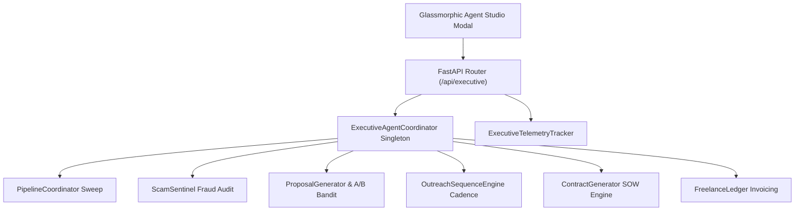

# Phase 26: AI Executive Agent & Autonomous Lead Acquisition Orchestrator (Autonomous Agent Studio)

## Overview
Phase 26 introduces the **AI Executive Agent & Autonomous Lead Acquisition Orchestrator** to `CLIENT FINDER SVC`. Functioning as an autonomous C-level supervisor, this module manages the end-to-end client acquisition lifecycle—from opportunity harvesting, scoring, and scam risk verification to proposal synthesis, A/B pitch selection, multi-step outreach enrollment, contract generation, and deposit invoice tracking.

---

## Key Capabilities

1. **Autonomous 7-Step Acquisition Loop (`src/executive/coordinator.py`)**
   - **Step 1: Multi-Source Pipeline Sweep**: Executes harvesting across active collectors and scores leads against developer skill taxonomy.
   - **Step 2: High-Priority Lead Selection**: Filters leads exceeding configurable score floors (`min_score_threshold`).
   - **Step 3: Scam Risk & Client Dossier Audit**: Verifies client credibility (`ScamSentinel`) and skips leads below trust risk floors (`scam_risk_floor`).
   - **Step 4: Contextual Proposal Synthesis**: Generates targeted proposals (`ProposalGenerator`) utilizing multi-armed bandit optimal pitch angles (`ProposalExperimenter`).
   - **Step 5: Autonomous Outreach Enrollment**: Enrolls client leads into multi-step outreach cadences (`OutreachSequenceEngine`).
   - **Step 6: Protective SOW Contract Generation**: Auto-synthesizes draft Statements of Work (`ContractGeneratorEngine`) with Net-14 payment terms and IP protection.
   - **Step 7: Kickoff Deposit Invoice Issuance**: Automatically logs 30% kickoff deposit invoices (`FreelanceLedger`).

2. **Executive Telemetry & Time Saved Tracking (`src/executive/telemetry.py`)**
   - Logs every executive action with estimated developer time saved metrics (average 1.5–2.5 hours saved per autonomous cycle).
   - Computes aggregated velocity metrics, decision counters, and cycle stats.

3. **Configurable Execution Autonomy Policies (`AutonomousPolicyConfig`)**
   - `DISABLED`: Pauses autonomous execution.
   - `SEMI_AUTONOMOUS` (Default): Auto-drafts proposals, contracts, and invoices for human review.
   - `FULLY_AUTONOMOUS`: Automatically dispatches outreach emails, executes contract workflows, and issues invoices.

4. **Glassmorphic Autonomous Agent Studio (`modal-executive`)**
   - Header button **"🤖 Executive Agent"**.
   - Live KPI overview cards (Cycles Executed, Proposals Drafted, Contracts Generated, Time Saved).
   - Policy controls panel (Autonomy Mode, Score Floor, Scam Floor, Auto SOW, Auto Invoice).
   - Real-time Executive Decision Audit Stream.

5. **CLI Subcommands**
   - `python -m src.cli executive-status`
   - `python -m src.cli executive-run`
   - `python -m src.cli executive-config --mode FULLY_AUTONOMOUS --min-score 80`

---

## System Architecture

---

## API Endpoints Summary

| Method | Endpoint | Description |
| :--- | :--- | :--- |
| `GET` | `/api/executive/status` | Retrieve system autonomy level, active policies, and velocity KPIs |
| `POST` | `/api/executive/config` | Update autonomy execution mode, risk floors, and daily lead quotas |
| `POST` | `/api/executive/cycle` | Trigger an immediate 7-step autonomous acquisition cycle |
| `GET` | `/api/executive/activity-log` | Stream real-time executive decision logs and time-saved metrics |

---

## Verification & Testing

- Unit test suite: `tests/unit/test_executive.py` (5/5 passing).
- Validates policy configuration persistence, telemetry metrics, autonomous 7-step cycle execution, disabled mode overrides, and REST API endpoints.
