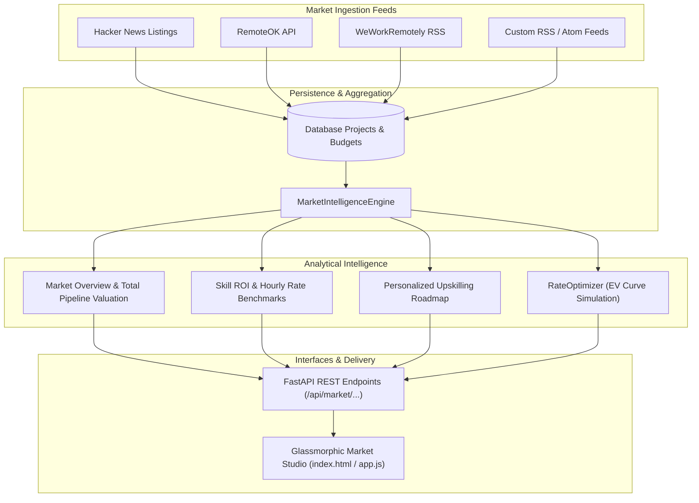

# AI Market Intelligence, Skill ROI Heatmaps & Rate Benchmark Forecasting Engine

## Executive Summary

Phase 15 equips **CLIENT FINDER SVC** with an enterprise-grade **AI Market Intelligence & Rate Optimization Studio**:
1. **Market Intelligence & Skill Analytics Engine (`MarketIntelligenceEngine`)**: Aggregates macro demand signals, compensation distributions, and skill co-occurrence across all multi-source opportunities (`Hacker News`, `RemoteOK`, `WeWorkRemotely`, custom RSS/Atom feeds).
2. **Skill Demand & Hourly Compensation Benchmarks**: Continuously computes listed project volume, market share, average contract budgets, and rate benchmarks ($/hr) for modern engineering stacks.
3. **High-Yield Upskilling Roadmap Generator**: Analyzes synergies with the developer's core skill profile to recommend high-paying adjacent technologies with quantified hourly rate premiums.
4. **Predictive Rate Forecaster & Proposal Yield Optimizer (`RateOptimizer`)**: Models price elasticity and Expected Value ($EV = \text{Price} \times P_{\text{win}}$) decay curves, synthesizing three distinct quoting strategies (`MAX_WIN_RATE`, `OPTIMAL_EV`, `PREMIUM_ANCHOR`).
5. **Interactive Web Dashboard Market Studio**: Visual dashboard featuring pipeline valuation metrics, skill compensation tables, upskilling roadmap cards, and an interactive EV pricing simulator.

---

## 1. Market Intelligence & Pricing Architecture

---

## 2. Component Specifications

### 2.1 Market Intelligence & Skill Analytics Engine (`src/analytics/intelligence.py`)
- **Macroeconomic Overview**:
  - `total_active_listings`: Active market project count.
  - `total_market_pipeline_value`: Total dollar volume across open contracts.
  - `average_project_value`: Mean project budget.
  - `primary_sources_breakdown`: Opportunity volume distribution by ingestion platform.
- **Skill ROI & Rate Benchmarking**:
  - Tracks metrics per technology: `demand_count`, `demand_share_pct`, `average_budget`, `median_budget`, `hourly_rate_benchmark`, and `growth_trend_pct`.
  - Blends empirical database statistics with baseline benchmark catalogs.
- **Upskilling Roadmap**:
  - Recommends complementary skills (e.g., RAG, Kubernetes, Rust, TypeScript) with quantified expected rate gains (+15% to +35%) based on stack synergy.

### 2.2 Predictive Rate & Expected Value Optimizer (`src/analytics/rate_optimizer.py`)
- **Expected Value Formula**:
  $$EV(r) = (r \times H) \times P_{\text{win}}(r, S, B)$$
  Where:
  - $r$: Proposed hourly rate ($/hr).
  - $H$: Estimated project effort hours.
  - $S$: Opportunity match score ($0 \le S \le 100$).
  - $B$: Client stated budget constraint (applies exponential penalty when $r \times H > B$).
- **Strategic Quoting Tiers**:
  - `MAX_WIN_RATE`: 0.75x baseline rate; maximizes win conversion for rapid pipeline building.
  - `OPTIMAL_EV`: Statistically maximizes total expected revenue yield.
  - `PREMIUM_ANCHOR`: 1.3x baseline rate; high-margin quote for enterprise architectural positioning.

---

## 3. REST API Endpoint Reference Catalog

| Route Group | Method | Path | Description |
| :--- | :--- | :--- | :--- |
| **Market** | `GET` | `/api/market/overview` | Macroeconomic pipeline valuation, top-paying skills, and source volume |
| **Market** | `GET` | `/api/market/skills/roi` | Ranked compensation benchmarks, demand counts, and growth trends |
| **Market** | `GET` | `/api/market/recommendations/upskill` | Personalized high-yield upskilling roadmap matching developer profile |
| **Market** | `POST` | `/api/market/optimize-rate` | Simulate Expected Value pricing curve ($EV = \text{Price} \times P_{\text{win}}$) |

---

## 4. Verification & Quality Assurance

- **Unit Tests**: 213/213 unit tests passing (100% pass rate).
- **Linter & Formatter**: 100% clean Ruff check and format pass across 128 files.
- **Static Type Checking**: 0 mypy errors across all 90 source modules.
