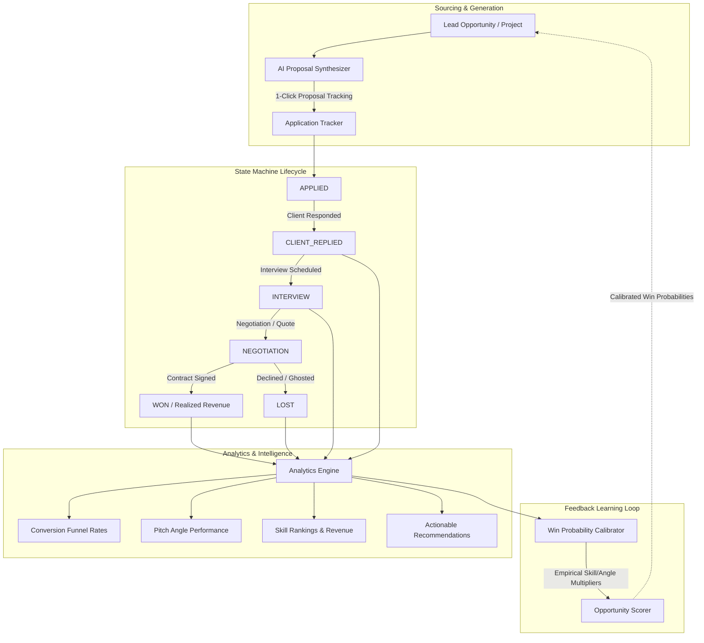

# Phase 10: Application & Proposal Outcome Tracking, Analytics & Feedback Learning Loop

## Executive Overview

**Phase 10** elevates **CLIENT-FINDER-SVC** into an intelligent, closed-loop **Client Acquisition, Proposal Outcome Tracking & ROI Intelligence Platform**. 

By tracking proposals from submission through client replies, discovery calls, negotiations, and closed contracts (won or lost), the system delivers:
1. **Application Lifecycle State Machine**: Enforces valid progression steps across 12 distinct stages (`APPLIED` $\rightarrow$ `CLIENT_REPLIED` $\rightarrow$ `INTERVIEW` $\rightarrow$ `NEGOTIATION` $\rightarrow$ `WON` / `LOST`), capturing automatic stage timestamps (`applied_at`, `response_at`, `interview_at`, `closed_at`).
2. **Real-Time Conversion Funnel & ROI Analytics**: Computes live response rates, interview conversion, win rates, pipeline value, realized revenue, average deal size, and response velocity.
3. **Strategic Pitch & Skill Ranking**: Evaluates conversion efficacy per pitch angle (`TECHNICAL_EXPERT`, `FAST_DELIVERY`, `VALUE_ROI`, etc.) and pinpoints highest-earning skill niches.
4. **Empirical Win Probability Feedback Loop**: Learns from historical outcomes to calibrate future project match scores dynamically using empirical multipliers ($0.50 \times \dots 2.00 \times$).
5. **Interactive UI & Terminal Control**: 3-tab glassmorphic web dashboard and intuitive CLI subcommands (`apply`, `apps`, `funnel`).

---

## Architecture & Data Flow



---

## 1. Application Lifecycle State Machine (`src/tracking/`)

### Lifecycle States (`ApplicationStatus`)

| Status Code | Description | Key Timestamps Populated |
| :--- | :--- | :--- |
| `DISCOVERED` | Opportunity indexed in system | Initial creation |
| `QUALIFIED` | Opportunity passed threshold match criteria | Score computed |
| `SHORTLISTED` | Flagged for proposal outreach | User selection |
| `PROPOSAL_GENERATED` | AI proposal drafted | `created_at` |
| `APPLIED` | Proposal or cover letter sent to client | `applied_at` |
| `CLIENT_REPLIED` | Client engaged / responded to outreach | `response_at` |
| `INTERVIEW` | Discovery call or interview scheduled | `interview_at` |
| `NEGOTIATION` | Scope, rate, or contract being negotiated | `updated_at` |
| `WON` | Contract won / client converted | `closed_at`, `final_revenue` |
| `LOST` | Opportunity lost, declined, or ghosted | `closed_at` |
| `CANCELLED` | Abandoned prior to proposal or closing | `closed_at` |
| `COMPLETED` | Project milestones delivered successfully | `closed_at` |

### Transition Safety Rules

The state machine validates forward progression. For example:
- `APPLIED` $\rightarrow$ `CLIENT_REPLIED`, `INTERVIEW`, `LOST`, `CANCELLED`
- `CLIENT_REPLIED` $\rightarrow$ `INTERVIEW`, `NEGOTIATION`, `WON`, `LOST`
- `INTERVIEW` $\rightarrow$ `NEGOTIATION`, `WON`, `LOST`
- `NEGOTIATION` $\rightarrow$ `WON`, `LOST`
- Non-standard jumps or transitions from terminal states can be forced with `force=True`.

---

## 2. Real-Time Conversion & Revenue Analytics (`src/analytics/`)

### Key Metrics Formulated

1. **Conversion Funnel Metrics**:
   $$\text{Response Rate} = \frac{N_{\text{replied}} + N_{\text{interview}} + N_{\text{negotiation}} + N_{\text{won}}}{N_{\text{total\_applied}}} \times 100\%$$
   $$\text{Interview Rate} = \frac{N_{\text{interview}} + N_{\text{negotiation}} + N_{\text{won}}}{N_{\text{total\_applied}}} \times 100\%$$
   $$\text{Win Rate} = \frac{N_{\text{won}}}{N_{\text{total\_applied}}} \times 100\%$$

2. **Velocity & Revenue Intelligence**:
   - **Average Response Velocity**: Mean elapsed hours between `applied_at` and `response_at`.
   - **Average Time to Close**: Mean elapsed days between `applied_at` and `closed_at`.
   - **Active Pipeline Value**: Sum of `proposed_budget` for in-flight applications (`APPLIED`, `CLIENT_REPLIED`, `INTERVIEW`, `NEGOTIATION`).
   - **Realized Revenue**: Sum of `final_revenue` for `WON` / `COMPLETED` contracts.
   - **Average Deal Size**: Realized revenue divided by total won contracts.

3. **Pitch Angle & Skill Attribution**:
   - Compares sent vs won proposals across `TECHNICAL_EXPERT`, `FAST_DELIVERY`, `VALUE_ROI`, `PORTFOLIO_PROOF`, `CONSULTATIVE_ADVISOR`.
   - Ranks skills by win conversion rate and total revenue contribution.

---

## 3. Empirical Win Probability Calibrator (`src/analytics/calibrator.py`)

The feedback learning loop continuously recalculates baseline developer win rates $W_{\text{base}} = \frac{N_{\text{won}}}{N_{\text{total}}}$ and empirical modifiers:

$$M_{\text{skill}} = \text{clamp}\left(\frac{W_{\text{skill}}}{W_{\text{base}}}, 0.50, 2.00\right)$$
$$M_{\text{pitch}} = \text{clamp}\left(\frac{W_{\text{pitch}}}{W_{\text{base}}}, 0.70, 1.50\right)$$

When scoring incoming leads, the calibrator adjusts raw win probability:
$$P_{\text{calibrated}} = \text{clamp}\left(P_{\text{base}} \times M_{\text{skill}} \times M_{\text{pitch}}, 5.0, 95.0\right)$$

This ensures that developer match scoring improves automatically as more application outcomes are logged.

---

## 4. REST API Reference

| Method | Endpoint | Description |
| :--- | :--- | :--- |
| `POST` | `/api/applications` | Track a new proposal submission |
| `GET` | `/api/applications` | List tracked applications (with status/angle filters) |
| `GET` | `/api/applications/{id}` | Retrieve application details |
| `PATCH` | `/api/applications/{id}/status` | Progress lifecycle state, record client feedback/revenue |
| `DELETE` | `/api/applications/{id}` | Remove application record |
| `GET` | `/api/analytics/funnel` | Conversion funnel counts, rates, velocity |
| `GET` | `/api/analytics/pitch-angles` | Comparative pitch angle performance |
| `GET` | `/api/analytics/skills` | Skill-level win rates and revenue generation |
| `GET` | `/api/analytics/revenue` | Pipeline value, realized revenue, deal sizes |
| `GET` | `/api/analytics/insights` | Automated strategic recommendations |
| `GET` | `/api/analytics/modifiers` | Calibrated empirical multipliers |

---

## 5. Command-Line Interface (CLI)

```bash
# Track a proposal submission directly from terminal
python -m src.cli apply --project-id 42 --status APPLIED --budget 6500 --pitch-angle TECHNICAL_EXPERT

# List all tracked applications
python -m src.cli apps --status WON

# View live conversion funnel, velocity, and AI strategy insights
python -m src.cli funnel
```

---

## 6. Interactive Web Dashboard

The web interface (`http://localhost:8000`) features 3 primary navigation tabs:
1. **🎯 Opportunities Feed**: Real-time leads feed with multi-dimension match scores and instant proposal synthesis modal.
2. **📋 Applications Pipeline**: Kanban/card view of tracked applications with 1-click status advancement buttons (`💬 Replied`, `🎙️ Interview`, `🏆 Won`, `❌ Lost`).
3. **📊 Conversion Analytics**: Visual glassmorphic funnel progress bars, pitch angle performance comparison table, top-earning skill rankings, and AI strategic recommendations.

---

## 7. Verification & Testing

- **Unit Tests**: 169 unit tests passing across all components with 0 regressions.
- **Code Quality**: `ruff check`, `ruff format`, and `mypy` passing 100% clean across 74 source files.
- **Live Script Verification**: Verified end-to-end via `python scripts/test_tracking_live.py`.
