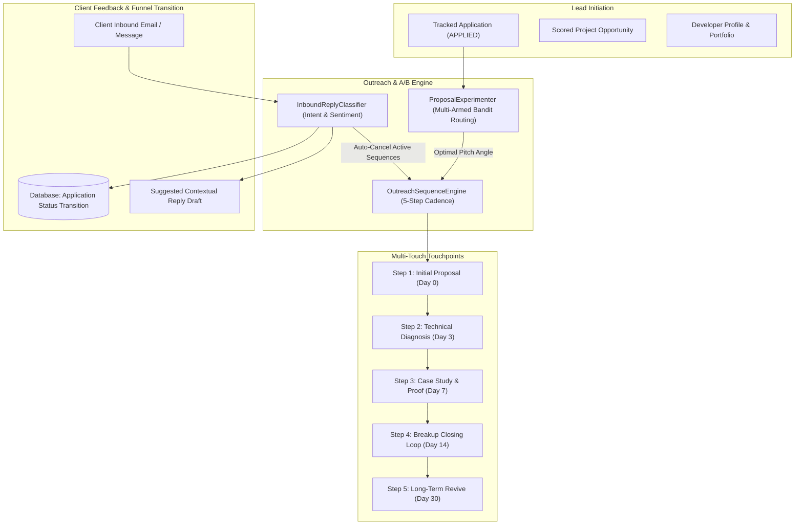

# Autonomous Lead Outreach, Dynamic A/B Pitch Experimentation & Inbound Intent Automation

## Executive Summary

Phase 16 transforms **CLIENT FINDER SVC** into an autonomous client engagement powerhouse. It introduces:
1. **Multi-Touch Outreach Sequence Engine (`OutreachSequenceEngine`)**: Orchestrates 5-step automated follow-up cadences (`INITIAL_PROPOSAL` $\to$ `DAY_3_DIAGNOSIS` $\to$ `DAY_7_CASE_STUDY` $\to$ `DAY_14_BREAKUP` $\to$ `DAY_30_REVIVE`) with conditional pause/cancellation upon client engagement or application funnel state advance.
2. **Inbound Reply Parser & Intent Classifier (`InboundReplyClassifier`)**: NLP & heuristic analyzer that parses incoming client replies, classifies intent (`POSITIVE_INTEREST`, `SCHEDULE_CALL`, `RATE_PUSHBACK`, `SCOPE_QUESTION`, `REJECTION`, `OUT_OF_OFFICE`), calculates sentiment, auto-transitions application funnel state in the database, and synthesizes high-converting response drafts.
3. **Dynamic A/B Pitch Testing Matrix (`ProposalExperimenter`)**: Multi-armed bandit / split-testing engine evaluating conversion rates across 5 pitch angles (`TECHNICAL_EXPERT`, `VALUE_ROI`, `FAST_DELIVERY`, `CONSULTATIVE_ADVISOR`, `CASE_STUDY_FIRST`) with 95% confidence intervals and domain-specific optimal pitch routing.
4. **Outreach & A/B Studio Web UI**: A dedicated "🚀 Outreach & A/B" interactive studio in the Glassmorphic Web Dashboard with cadence timeline inspector, live inbound reply analyzer, and A/B statistical conversion matrix.
5. **CLI Integration**: Subcommands `outreach create`, `outreach list`, `outreach advance`, `reply`, and `ab-stats`.

---

## 1. Outreach & Conversion Architecture

---

## 2. Component Specifications

### 2.1 Multi-Touch Outreach Sequence Automator (`src/outreach/sequences.py`)
- **Cadence Touchpoints**:
  - **Step 1 (`INITIAL_PROPOSAL`, 0d)**: Context-aware pitch citing target tech stack and project milestones.
  - **Step 2 (`DAY_3_DIAGNOSIS`, +3d)**: Architectural insight highlighting proactive solutions (async worker queuing, fault tolerance, caching) and low-friction alignment invite.
  - **Step 3 (`DAY_7_CASE_STUDY`, +7d)**: Concrete performance benchmark (e.g. 42% latency reduction) citing verified past deliverables.
  - **Step 4 (`DAY_14_BREAKUP`, +14d)**: Reverse-psychology closing loop email respecting founder time.
  - **Step 5 (`DAY_30_REVIVE`, +30d)**: Friendly check-in for Phase 2 or new technical bottlenecks.
- **Auto-Cancellation**: If an application status transitions to `CLIENT_REPLIED`, `INTERVIEW`, `NEGOTIATION`, `WON`, or `LOST`, active sequences are automatically cancelled to prevent embarrassing or redundant follow-ups.

### 2.2 Inbound Reply Parser & Intent Classifier (`src/outreach/inbound.py`)
- **Classified Intent Taxonomy**:
  - `SCHEDULE_CALL`: Client requests Zoom/Meet/interview $\to$ transitions application to `INTERVIEW` and provides availability schedule.
  - `RATE_PUSHBACK`: Client pushes back on budget $\to$ transitions application to `NEGOTIATION` and drafts Scope Modulation counter-offer.
  - `POSITIVE_INTEREST`: Client expresses enthusiasm $\to$ transitions to `CLIENT_REPLIED` and drafts alignment confirmation.
  - `SCOPE_QUESTION`: Client asks technical questions $\to$ drafts diagnostic architectural response.
  - `REJECTION`: Client filled position $\to$ transitions to `LOST` and drafts gracious closing loop.
  - `OUT_OF_OFFICE`: Automated autoreply $\to$ leaves status at `APPLIED` and snoozes sequence.

### 2.3 Dynamic A/B Proposal Pitch Experimenter (`src/outreach/experiments.py`)
- **Conversion Math**:
  $$\text{Reply Rate} = \frac{\text{Replies}}{\text{Impressions}} \times 100$$
  $$\text{Win Rate} = \frac{\text{Wins}}{\text{Impressions}} \times 100$$
  $$\text{Composite Score} = 0.6 \times \text{Reply Rate} + 0.4 \times \text{Win Rate}$$
- **95% Confidence Interval**:
  $$\text{CI}_{95\%} = p \pm 1.96 \sqrt{\frac{p(1-p)}{n}}$$
- **Epsilon-Greedy Routing**: With probability $\epsilon = 0.15$, explores alternative pitch angles; with probability $1 - \epsilon$, exploits the category's historically winning pitch angle.

---

## 3. REST API Endpoint Reference Catalog

| Route Group | Method | Path | Description |
| :--- | :--- | :--- | :--- |
| **Outreach** | `POST` | `/api/outreach/sequences` | Create and initialize an automated 5-step outreach cadence |
| **Outreach** | `GET` | `/api/outreach/sequences` | List tracked outreach cadences and step progression |
| **Outreach** | `GET` | `/api/outreach/sequences/{id}` | Get full step timeline and copy for a sequence |
| **Outreach** | `POST` | `/api/outreach/sequences/{id}/advance` | Execute pending touchpoint and advance to next step |
| **Outreach** | `POST` | `/api/outreach/sequences/{id}/pause` | Pause active outreach cadence |
| **Outreach** | `POST` | `/api/outreach/sequences/{id}/resume` | Resume paused outreach cadence |
| **Outreach** | `POST` | `/api/outreach/sequences/{id}/cancel` | Cancel an outreach sequence |
| **Inbound** | `POST` | `/api/outreach/inbound/analyze` | Classify client reply intent, transition status, and draft reply |
| **A/B Testing** | `GET` | `/api/outreach/experiments/pitch-stats` | Retrieve statistical A/B pitch conversion summary |
| **A/B Testing** | `POST` | `/api/outreach/experiments/record` | Record pitch impression, reply, or win outcome |
| **A/B Testing** | `GET` | `/api/outreach/experiments/recommend-pitch`| Get statistically optimal pitch angle for a category |

---

## 4. Verification & Quality Assurance

- **Unit Tests**: 242/242 unit tests passing (100% pass rate).
- **Linter & Formatter**: 100% clean Ruff check and format pass.
- **Static Type Checking**: 0 mypy errors across all modules.
