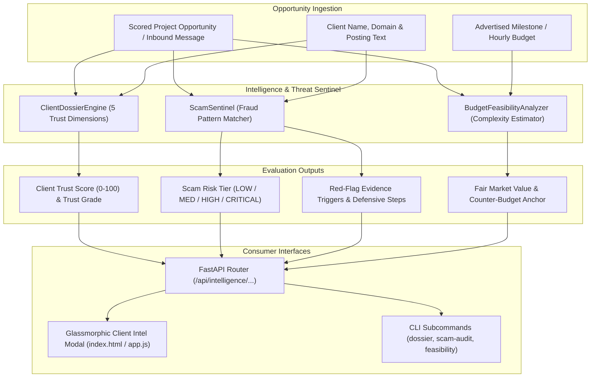

# Phase 19: AI Client Dossier, Deep Background Intelligence & Scam Risk Sentinel

## Executive Summary

Phase 19 provides **CLIENT FINDER SVC** with proactive client trust verification, threat modeling, and commercial defense:
1. **Client Intelligence Dossier Engine (`ClientDossierEngine`)**: Synthesizes structured background dossiers, infers company domains, identifies tech footprints, and calculates a multi-factor **Client Trust Score** (0–100) and **Trust Grade** (`EXCELLENT`, `VERIFIED`, `MODERATE`, `UNVERIFIED`, `SUSPICIOUS`).
2. **Scam Risk Sentinel (`ScamSentinel`)**: Scans opportunity postings and client direct messages for fraud triggers (off-platform Telegram/WhatsApp payment redirection, fake check/equipment reimbursement scams, unpaid multi-day test tasks, crypto activation fees, and abnormal budget ratios), generating an explainable **Risk Tier** (`LOW`, `MEDIUM`, `HIGH`, `CRITICAL`) and concrete defensive actions.
3. **Scope & Budget Feasibility Analyzer (`BudgetFeasibilityAnalyzer`)**: Calibrates requested functional scope against realistic engineering hours and market rates, predicting scope-creep risks and recommending structured counter-budget anchors.
4. **FastAPI REST API Layer (`src/api/routes/client_intel.py`)**: Endpoints mounted under `/api/intelligence/...` for client dossier synthesis, scam risk auditing, feasibility estimation, and 1-click project analysis.
5. **Interactive Glassmorphic Studio UI**: "🛡️ Client Intel & Scam Sentinel" studio modal in the Web Dashboard.
6. **CLI Commands**: `dossier`, `scam-audit`, and `feasibility`.

---

## 1. System Architecture & Threat Model

---

## 2. Component Specifications

### 2.1 Client Dossier Engine (`src/intelligence/dossier.py`)
- **Evaluates 5 Weighted Dimensions**:
  1. **Domain Credibility (Weight: 25%)**: Verified custom company domains (`.com`, `.io`, `.ai`) vs. anonymous handles.
  2. **Hiring History & Team Scale (Weight: 25%)**: Mentions of active engineering teams, funded rounds (Series A/B), and production repositories.
  3. **Budget Transparency (Weight: 20%)**: Explicit fixed milestone or hourly bounds vs. undisclosed rates.
  4. **Requirement Clarity (Weight: 15%)**: Specific architecture and component definitions vs. vague one-liners.
  5. **Payment Security & Board Reputability (Weight: 15%)**: Discovery platform trust signals (Hacker News, RemoteOK, WWR).
- **Categorical Trust Grades**:
  - `85.0 - 100.0`: **EXCELLENT** (Standard 30% kickoff milestone structure)
  - `70.0 - 84.9`: **VERIFIED** (Standard contract with formal Change Order clauses)
  - `55.0 - 69.9`: **MODERATE** (50% upfront deposit or weekly sprint billing)
  - `40.0 - 54.9`: **UNVERIFIED** (100% funded platform escrow or paid exploration spike)
  - `< 40.0`: **SUSPICIOUS** (High risk; decline unpaid code or unverified wire payments)

### 2.2 Scam Risk Sentinel (`src/intelligence/scam_sentinel.py`)
- **Scam Patterns & Triggers**:
  - `OFF_PLATFORM_PAYMENT`: Redirection to Telegram, WhatsApp, direct PayPal, or wire transfer before contract.
  - `CHECK_CASHING_EQUIPMENT_SCAM`: Advance check reimbursement schemes to purchase hardware from "approved vendors".
  - `FREE_WORK_TEST_TASK`: Unpaid multi-day test tasks or building full production features as a free evaluation.
  - `CRYPTO_UNVERIFIED_ESCROW`: Upfront registration fees, unverified token payouts, or deposits to activate accounts.
  - `UNREALISTIC_BUDGET_RATIO`: Abnormally inflated budgets for trivial fixes ($50,000 for typo fix) or extreme lowballing ($100 for Uber clone).
- **Risk Tiers**:
  - `LOW`: Completely safe, legitimate parameters.
  - `MEDIUM`: Elevated caution, non-standard terms.
  - `HIGH`: Multiple red flags, potential exploitation.
  - `CRITICAL`: Confirmed fraud pattern detected.

### 2.3 Budget Feasibility Analyzer (`src/intelligence/feasibility.py`)
- **Estimates Base Engineering Hours**:
  - Base CRUD backend: 20–40 hours.
  - React / Next.js UI additions: +20–35 hours.
  - AI / LLM / Vector RAG additions: +25–45 hours.
  - Real-time WebSockets / Celery workers: +15–30 hours.
  - Auth, Stripe billing, and Database migrations: +15–25 hours.
- **Fair Market Budget Calculation**:
  $$\text{Fair Market Budget} = \text{Average Estimated Hours} \times \text{Target Hourly Rate}$$
- **Variance Analysis & Scope Phasing**:
  - $\text{Variance} \ge -20\%$: `REALISTIC`
  - $-45\% \le \text{Variance} < -20\%$: `SLIGHTLY_UNDERBUDGETED`
  - $-75\% \le \text{Variance} < -45\%$: `UNREALISTIC_LOW_BUDGET`
  - $\text{Variance} < -75\%$: `HIGH_RISK_SCOPE_CREEP`

---

## 3. REST API Endpoint Reference Catalog

| Route Group | Method | Path | Description |
| :--- | :--- | :--- | :--- |
| **Intelligence** | `POST` | `/api/intelligence/client-dossier` | Generate client background dossier, domain credentials, and trust score |
| **Intelligence** | `POST` | `/api/intelligence/scam-audit` | Scan opportunity description for scams, fake checks, and free work traps |
| **Intelligence** | `POST` | `/api/intelligence/budget-feasibility` | Evaluate complexity vs. proposed budget and calculate fair market pricing |
| **Intelligence** | `GET` | `/api/intelligence/from-project/{project_id}` | 1-click comprehensive dossier, scam audit, and feasibility for a stored project |

---

## 4. Verification & Quality Summary

- **Automated Tests**: **255 / 255 passing** (`pytest`, 100% pass rate).
- **Linter & Formatter**: 100% clean check (`ruff check .`, `ruff format --check .`).
- **Static Type Checking**: **0 issues in 108 source files** (`mypy src`).
