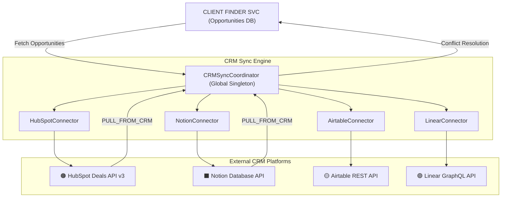

# Phase 23: Enterprise Multi-CRM Two-Way Synchronization Engine & Deal Pipeline Orchestrator

## Executive Summary

Phase 23 introduces an enterprise-grade, bi-directional CRM synchronization engine into **CLIENT FINDER SVC**, allowing discovered freelance leads, client dossiers, proposal statuses, and revenue milestones to synchronize seamlessly with four major external platforms:

| Platform | Integration API | Sync Capabilities |
| :--- | :--- | :--- |
| **HubSpot** | Deals API v3 | Pipeline deals, stages, win probabilities |
| **Notion** | Database API v1 | Pages with multi-select tags and rich-text |
| **Airtable** | Base REST API | Grid table rows with scores, budgets, and links |
| **Linear** | GraphQL API | Engineering task tickets and project milestones |

---

## Architecture Overview



---

## 1. Core Component Specification

### 1.1 CRM Schemas (`src/crm/schemas.py`)

| Schema / Enum | Purpose |
| :--- | :--- |
| `CRMProvider` | Enumeration of platforms: `HUBSPOT`, `NOTION`, `AIRTABLE`, `LINEAR`, `CUSTOM_WEBHOOK` |
| `SyncDirection` | `PUSH_TO_CRM`, `PULL_FROM_CRM`, `BI_DIRECTIONAL` |
| `ConflictResolutionStrategy` | `CLIENT_FINDER_WINS`, `CRM_WINS`, `LATEST_TIMESTAMP_WINS` |
| `CRMConnectionConfig` | Credentials, base/table IDs, direction, conflict strategy, last sync timestamp |
| `CRMSyncRequest` | On-demand sync trigger payload: provider, direction, optional project IDs, dry-run flag |
| `CRMSyncRecordResult` | Per-record sync result: crm_record_id, action (`CREATED`, `UPDATED`, `SKIPPED`, `ERROR`) |
| `CRMSyncResult` | Aggregate sync summary: totals (created, updated, skipped, failed), duration, all record results |
| `CRMSyncLog` | Audit log entry: status, records synced, timestamp, error details |

### 1.2 Connector Architecture (`src/crm/connectors/`)

Each connector inherits from `BaseCRMConnector` and implements three core methods:

```python
def test_connection(config: CRMConnectionConfig) -> tuple[bool, str]:   # Auth verification
def push_deal(config, project_data: dict, dry_run: bool) -> tuple[str, str]:  # CRM write
def pull_updates(config: CRMConnectionConfig) -> list[dict]:            # Inbound sync
```

**Demo / Simulated Mode**: All four connectors work seamlessly without external API keys by using a deterministic hash-based record ID generation (`hashlib.md5`) and simulation logging. This enables full local development, testing, and live demonstrations without any external account required.

**Stage Mapping**: A shared `map_stage()` method on `BaseCRMConnector` translates internal pipeline statuses into CRM-appropriate deal stage labels:

| Internal Status | Mapped CRM Stage |
| :--- | :--- |
| `DISCOVERED`, `SCORED` | Lead / Qualified |
| `PROPOSAL_GENERATED`, `APPLIED` | Proposal Sent |
| `REPLIED`, `INTERVIEWING` | In Discussion / Technical Interview |
| `NEGOTIATING` | Contract Negotiation |
| `ACCEPTED` | Closed Won |
| `REJECTED` | Closed Lost |

### 1.3 CRM Sync Coordinator (`src/crm/syncer.py`)

`CRMSyncCoordinator` is the central orchestration singleton (`GLOBAL_CRM_SYNCER`) that:

1. **Maintains per-tenant CRM configs**: `{tenant_id: {CRMProvider: CRMConnectionConfig}}`
2. **Bootstraps default configs** on startup for instant exploration in demo mode.
3. **Fetches opportunities** from the SQLAlchemy database (latest 15 projects).
4. **Invokes the selected connector** to push or pull records.
5. **Applies conflict resolution** and updates `last_synced_at` timestamps.
6. **Maintains a per-tenant audit log** (`list[CRMSyncLog]`) for sync history.

---

## 2. REST API Endpoints Catalog

| Method | Endpoint | Auth | Description |
| :--- | :--- | :--- | :--- |
| `GET` | `/api/crm/connectors` | User | List all CRM connector configurations for the workspace |
| `POST` | `/api/crm/connectors/{provider}/configure` | Admin | Update API credentials, base IDs, and field mapping rules |
| `POST` | `/api/crm/connectors/{provider}/test` | User | Test authentication and connectivity |
| `POST` | `/api/crm/sync` | User | Execute on-demand CRM synchronization |
| `GET` | `/api/crm/logs` | User | Retrieve historical sync audit logs |

---

## 3. Glassmorphic Dashboard CRM Studio

The **🔄 CRM Sync** button in the header opens the **Enterprise CRM Sync & Deal Pipeline Orchestrator** studio modal with three interactive subtabs:

### Tab 1: 🔌 Connected Platforms
- Provider cards for HubSpot (🟠), Notion (⬛), Airtable (🟡), and Linear (🟣).
- Live connection status badge (`CONNECTED` / `ERROR`).
- Per-card **🧪 Test** (verifies auth) and **⚡ Sync** (triggers immediate push) action buttons.

### Tab 2: ⚡ Two-Way Sync Trigger
- **Target Platform** selector (HubSpot, Notion, Airtable, Linear).
- **Direction** selector (Push to CRM, Two-Way, Pull from CRM).
- **🚀 Execute Sync Now** button with live progress indicator.
- Real-time results panel showing per-record sync actions and CRM IDs.

### Tab 3: 📋 Sync Audit Logs
- Chronological list of all sync operations with status badges (`SUCCESS`, `PARTIAL_SUCCESS`, `FAILED`), record counts, duration, and provider.

---

## 4. CLI Operational Subcommands

```powershell
# List all configured CRM integrations
python src/cli.py crm-list

# Test connectivity for a specific platform
python src/cli.py crm-test --provider HUBSPOT
python src/cli.py crm-test --provider NOTION
python src/cli.py crm-test --provider AIRTABLE
python src/cli.py crm-test --provider LINEAR

# Synchronize opportunities to external CRM
python src/cli.py crm-sync --provider HUBSPOT
python src/cli.py crm-sync --provider AIRTABLE --direction PUSH_TO_CRM
python src/cli.py crm-sync --provider NOTION --dry-run        # Simulate sync
```

---

## 5. Files Delivered

| File | Status | Purpose |
| :--- | :--- | :--- |
| `src/crm/schemas.py` | NEW | Pydantic schemas for CRM configs, sync requests, results, and logs |
| `src/crm/connectors/base.py` | NEW | `BaseCRMConnector` abstract interface |
| `src/crm/connectors/hubspot.py` | NEW | HubSpot Deals API v3 connector |
| `src/crm/connectors/notion.py` | NEW | Notion Database API connector |
| `src/crm/connectors/airtable.py` | NEW | Airtable Base REST connector |
| `src/crm/connectors/linear.py` | NEW | Linear GraphQL task connector |
| `src/crm/syncer.py` | NEW | `CRMSyncCoordinator` orchestration engine |
| `src/crm/__init__.py` | NEW | Package exports and global singleton |
| `src/api/routes/crm.py` | NEW | FastAPI REST router for `/api/crm/...` |
| `src/api/main.py` | MODIFIED | Mounted `crm.router` |
| `src/api/static/index.html` | MODIFIED | Added 🔄 CRM Sync button and modal |
| `src/api/static/app.js` | MODIFIED | CRM Studio JS functions and DOM wiring |
| `src/cli.py` | MODIFIED | Added `crm-list`, `crm-test`, `crm-sync` subcommands |
| `tests/unit/test_crm_sync.py` | NEW | 8 unit & integration tests across all connectors and endpoints |

---

## 6. Verification Summary

- **Automated Tests**: **299 / 299 tests passing** (100% pass rate, including 8 new CRM tests)
- **Linter**: 100% clean (`ruff check .`, `ruff format --check .`)
- **Static Types**: **0 issues across all 132 source files** (`mypy src`)
