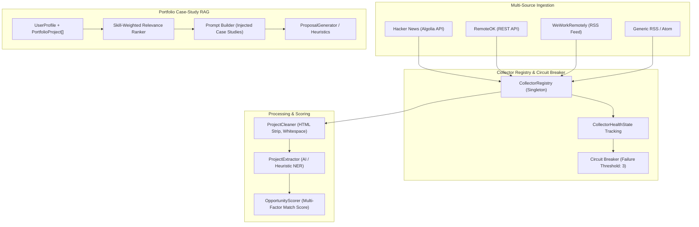

# Multi-Source Collector Expansion, Collector Registry & Portfolio Case-Study RAG

## Executive Summary

Phase 11 extends **CLIENT FINDER SVC** from a single-source scraper into an enterprise-grade, multi-platform opportunity intelligence and proposal synthesis engine. It introduces:
1. **Multi-Source Collector Ecosystem**: Direct integrations with RemoteOK (REST JSON API), WeWorkRemotely (RSS 2.0 XML), and generic RSS 2.0 / Atom feed ingestion.
2. **Dynamic Collector Registry & Circuit Breaker**: Real-time health monitoring, consecutive failure tracking, automatic circuit-breaker protection, manual resets, and live source toggling.
3. **Developer Portfolio Case-Study RAG**: Structural portfolio modeling (`PortfolioProject`), skill-weighted relevance ranking (`find_relevant_portfolio`), and dynamic injection of concrete business achievements and stack proof into AI and heuristic proposals.
4. **Interactive Dashboard Controls**: Source health telemetry modal, source feed filtering, live multi-source harvesting, and developer portfolio management.

---

## 1. Architectural Overview



---

## 2. Component Specifications

### 2.1 Multi-Source Collectors (`src/collectors/`)

- **`RemoteOKCollector` (`src/collectors/remoteok_collector.py`)**:
  - Connects to `https://remoteok.com/api`.
  - Cleans HTML formatting, parses salary minimums/maximums, normalizes tags, and handles rate limiting.
- **`WeWorkRemotelyCollector` (`src/collectors/weworkremotely_collector.py`)**:
  - Ingests `https://weworkremotely.com/categories/remote-programming-jobs.rss`.
  - Parses XML `<item>` entries, extracts client company names from `Company: Title` patterns, parses RFC 2822 publication dates into UTC ISO-8601 timestamps.
- **`RSSFeedCollector` (`src/collectors/rss_collector.py`)**:
  - Reusable, configurable parser for any standard RSS 2.0 or Atom XML feed.
  - Safe namespace resolution (`{http://www.w3.org/2005/Atom}`) and CDATA extraction.

### 2.2 Collector Registry & Circuit Breaker (`src/collectors/registry.py`)

- **`CollectorHealthState`**:
  - Metrics: `success_count`, `failure_count`, `consecutive_failures`, `total_items_collected`, `last_scrape_at`, `last_error`, `circuit_broken`.
  - `success_rate`: Computed percentage of successful executions.
- **Circuit Breaker Logic**:
  - Trips when `consecutive_failures >= failure_threshold` (default: 3).
  - Automatically suppresses failing collectors from `get_active_collectors()` to prevent pipeline blocking.
  - Supports manual reset via `POST /api/collectors/{source_name}/reset-circuit`.

### 2.3 Portfolio Case-Study RAG (`src/models/profile.py` & `src/proposal/`)

- **`PortfolioProject` Model**:
  ```python
  class PortfolioProject(BaseModel):
      title: str
      description: str
      technologies: list[str]
      outcomes: list[str]
      case_study_url: str | None = None
  ```
- **Relevance Retrieval (`UserProfile.find_relevant_portfolio`)**:
  - Computes intersection between opportunity target skills and portfolio project technology tags.
  - Performs keyword matching across project descriptions.
  - Ranks top $N$ case studies for inclusion in proposal context.
- **Context Injection**:
  - Injects matched case studies with concrete business metrics (e.g. *"Reduced client customer support response times by 65%"*) into prompt generation and heuristic templates.

---

## 3. REST API Endpoints

| Method | Endpoint | Description |
| :--- | :--- | :--- |
| `GET` | `/api/collectors` | List all registered sources and health summary |
| `GET` | `/api/collectors/health` | Retrieve detailed telemetry, success rates, and circuit status |
| `POST` | `/api/collectors/{source_name}/toggle` | Enable or disable a specific source collector |
| `POST` | `/api/collectors/{source_name}/reset-circuit`| Reset a tripped circuit breaker for a source |
| `POST` | `/api/collectors/collect` | Harvest from a single source or `"all"` sources |

---

## 4. Verification & Testing

- **148 Unit Tests**: 100% pass rate (`tests/unit/test_multi_collectors.py`, `test_api.py`, `test_proposal.py`, etc.).
- **Live Verification**: `scripts/test_collectors_live.py` validated live RemoteOK API responses, WeWorkRemotely RSS parsing, and proposal synthesis citing portfolio case studies.
- **Zero Linter / Type Errors**: Passed `ruff format`, `ruff check`, and `mypy src/`.
