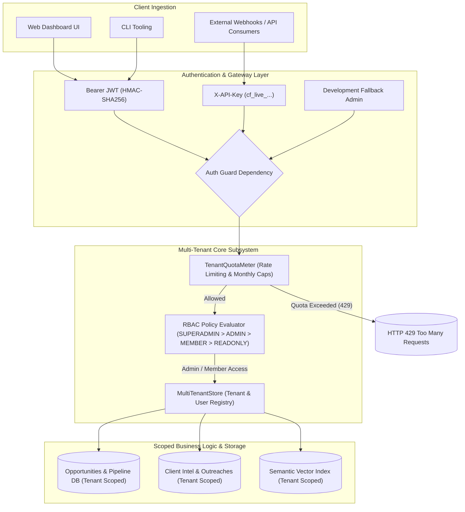

# Phase 21: Multi-Tenant SaaS Workspace, Team RBAC, API Key Metering & User Authentication

## Executive Summary

Phase 21 elevates **CLIENT FINDER SVC** into a production-grade multi-tenant Software-as-a-Service (SaaS) platform, providing tenant data isolation, hierarchical Role-Based Access Control (RBAC), programmatic API key metering, and cryptographic authentication:
1. **Multi-Tenant SaaS Workspaces (`MultiTenantStore`, `Tenant`, `User`)**:
   - Organization / workspace tenancy with 4 plan tiers: `FREE` (1 seat, 250 req/mo), `STARTER` (3 seats, 2.5k req/mo), `PRO` (10 seats, 25k req/mo), and `ENTERPRISE` (100 seats, 500k req/mo).
   - Automatic workspace provisioning upon user registration with isolated member rosters.
2. **Hierarchical Role-Based Access Control (RBAC)**:
   - 4 hierarchical role levels: `SUPERADMIN` (4) > `ADMIN` (3) > `MEMBER` (2) > `READONLY` (1).
   - Dynamic FastAPI role dependency guards (`require_role(min_role)`), enforcing strict privilege boundaries on administrative actions (e.g. member invites, API key revocation, workspace settings).
3. **Cryptographic Security & JWT Engine (`src/auth/security.py`)**:
   - PBKDF2-HMAC-SHA256 password hashing with 100,000 iterations and 16-byte random salt.
   - HMAC-SHA256 signed JSON Web Tokens (JWT) for stateless bearer authentication.
   - Programmatic API keys with `cf_live_<prefix>_<secret>` structure and SHA-256 hash validation.
4. **Sliding-Window Rate Limiter & Quota Meter (`TenantQuotaMeter`)**:
   - High-throughput sliding-window minute rate limiter (token bucket).
   - Monthly request consumption tracking with automatic calendar month rollover.
   - RFC-standard rate limit response headers (`X-RateLimit-Limit`, `X-RateLimit-Remaining`, `X-Quota-Monthly-Limit`, `X-Quota-Monthly-Remaining`) and HTTP 429 defenses.
5. **FastAPI REST API Layer (`/api/auth/...`, `/api/tenants/...`, `/api/apikeys/...`)**:
   - User registration, login, profile discovery, team member invitations, role updates, and API key lifecycle management.
6. **Interactive Glassmorphic Studio UI**:
   - "🏢 Workspace & Team" studio modal in the Web Dashboard featuring live quota cards, team member roster, and 1-click API key generation with clipboard copy.
7. **CLI Subcommands**:
   - `auth-register`, `auth-login`, `apikey-create`, `apikey-list`, `team-list`, and `team-invite`.

---

## 1. Multi-Tenant Architecture & RBAC Flow



---

## 2. RBAC Permission & Plan Tier Matrix

### 2.1 Role Hierarchy

| Role | Rank Level | Lead Ingestion & Search | AI Proposals & Outreach | Member Management | API Key Issuance | Plan & Billing |
| :--- | :---: | :---: | :---: | :---: | :---: | :---: |
| **`SUPERADMIN`** | 4 | ✅ Full | ✅ Full | ✅ Full Across Tenants | ✅ Full Across Tenants | ✅ Global System Config |
| **`ADMIN`** | 3 | ✅ Full | ✅ Full | ✅ Workspace Members | ✅ Workspace Keys | ✅ Workspace Plan |
| **`MEMBER`** | 2 | ✅ Full | ✅ Full | ❌ Denied | ❌ Denied | ❌ Denied |
| **`READONLY`** | 1 | 👁️ View Only | ❌ Denied | ❌ Denied | ❌ Denied | ❌ Denied |

### 2.2 SaaS Plan Tier Specifications

| Plan Tier | Max Team Seats | Monthly Request Cap | Rate Limit / Minute | Semantic Vector Search | Real-time Streaming |
| :--- | :---: | :---: | :---: | :---: | :---: |
| **`FREE`** | 1 seat | 250 req/mo | 30 req/min | ✅ Included | ✅ Included |
| **`STARTER`** | 3 seats | 2,500 req/mo | 120 req/min | ✅ Included | ✅ Included |
| **`PRO`** | 10 seats | 25,000 req/mo | 600 req/min | ✅ Included | ✅ Included |
| **`ENTERPRISE`** | 100 seats | 500,000 req/mo | 3,000 req/min | ✅ Included | ✅ Included |

---

## 3. REST API Endpoint Catalog

| Group | Method | Path | Auth / RBAC | Response Model | Description |
| :--- | :--- | :--- | :--- | :--- | :--- |
| **Auth** | `POST` | `/api/auth/register` | Public | `TokenResponse` | Register user and provision initial workspace |
| **Auth** | `POST` | `/api/auth/login` | Public | `TokenResponse` | Authenticate credentials and issue signed JWT |
| **Auth** | `GET` | `/api/auth/me` | Bearer / API Key | `UserProfileResponse` | Retrieve current authenticated user profile |
| **Tenants**| `GET` | `/api/tenants/current` | Bearer / API Key | `TenantResponse` | Current workspace metadata and team roster |
| **Tenants**| `GET` | `/api/tenants/quota` | Bearer / API Key | `QuotaUsageResponse` | Real-time request quota and throughput metrics |
| **Tenants**| `POST` | `/api/tenants/invite` | `ADMIN` Required | `TenantMemberItem` | Invite team member with specific RBAC role |
| **Tenants**| `PATCH`| `/api/tenants/members/{uid}` | `ADMIN` Required | `TenantMemberItem` | Update member role or active status |
| **API Keys**| `POST` | `/api/apikeys` | `ADMIN` Required | `ApiKeyCreatedResponse` | Issue programmatic API key (`cf_live_...`) |
| **API Keys**| `GET` | `/api/apikeys` | Bearer / API Key | `list[ApiKeyResponse]` | List active and revoked API keys |
| **API Keys**| `DELETE`| `/api/apikeys/{key_id}` | `ADMIN` Required | `204 No Content` | Revoke a programmatic API key |

---

## 4. CLI Subcommand Catalog

```powershell
# 1. Register a new SaaS user and workspace
python src/cli.py auth-register --email founder@agency.co --password SecretPass123! --name "Morgan Vance" --workspace "Vance Agency"

# 2. Authenticate and obtain JWT token
python src/cli.py auth-login --email founder@agency.co --password SecretPass123!

# 3. Issue a new programmatic API key
python src/cli.py apikey-create --name "Production Webhook Ingestion"

# 4. List workspace API keys
python src/cli.py apikey-list

# 5. List team members and RBAC roles
python src/cli.py team-list

# 6. Invite a new team member
python src/cli.py team-invite --email devops@clientfinder.local --name "Alex Morgan" --role ADMIN
```

---

## 5. Verification & Quality Summary

- **Automated Tests**: **280 / 280 passing** (`pytest`, 100% pass rate).
- **Linter & Formatter**: 100% clean check across all files (`ruff check .`, `ruff format --check .`).
- **Static Type Checking**: **0 issues across all 123 source files** (`mypy src`).
