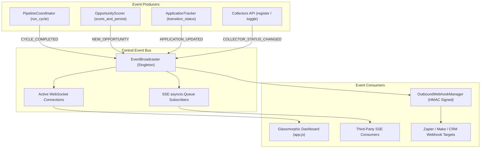

# Real-Time Live Streaming, Dynamic Custom Feeds & Integration Export Hub

## Executive Summary

Phase 13 elevates **CLIENT FINDER SVC** into a real-time, event-driven integration hub. It introduces:
1. **Real-Time Live Event Bus (`EventBroadcaster`)**: Bi-directional WebSockets (`/api/ws/events`) and Server-Sent Events (`/api/events/stream`) broadcasting newly discovered opportunities, harvest cycle telemetry, and application status transitions directly to connected browser clients without manual polling.
2. **Dynamic Custom Feed Builder (`POST /api/collectors/custom`)**: Allows users to register arbitrary RSS/Atom job feeds dynamically at runtime. The system verifies XML syntax, ingests sample leads, persists the source to the database, and binds it to the active collector registry with health monitoring.
3. **Enterprise Data Export Hub**: Export filtered opportunities to RFC 4180 compliant CSV spreadsheets (`/api/export/csv`), structured JSON dumps (`/api/export/json`), and customized proposals formatted in clean GitHub Markdown (`/api/export/proposals/{id}/markdown`).
4. **Outbound HMAC-SHA256 Authenticated Webhooks**: Automated dispatch of high-value leads ($S \ge \text{min\_score}$) to Zapier, Make, custom CRMs, or webhooks with cryptographic payload signing (`X-ClientFinder-Signature: sha256=...`).
5. **Upgraded Web Dashboard**: Real-time `🟢 LIVE` connection badge, instant toast notifications on incoming leads, 1-click export buttons, and custom RSS feed registration UI.

---

## 1. Real-Time Event Architecture

---

## 2. Component Specifications

### 2.1 Real-Time Event Broadcasting Subsystem (`src/api/events.py` & `src/api/routes/events.py`)
- **`EventType` Taxonomy**:
  - `NEW_OPPORTUNITY`: Emitted when a project is saved and scored.
  - `CYCLE_COMPLETED`: Emitted when an autonomous harvest cycle finishes.
  - `APPLICATION_UPDATED`: Emitted when an application lifecycle stage changes.
  - `COLLECTOR_STATUS_CHANGED`: Emitted when a source is enabled, disabled, or added.
  - `PING`: Keep-alive handshake messages.
- **WebSocket Endpoint (`/api/ws/events`)**: Asynchronous bi-directional streaming with automated ping/pong keep-alive and connection recovery.
- **Server-Sent Events (`/api/events/stream`)**: Fallback unidirectional stream for lightweight curl/CLI monitoring or firewalled environments.

### 2.2 Dynamic Custom Feed Registration (`POST /api/collectors/custom`)
- **Validation**: Performs live HTTP GET and ElementTree XML parsing to verify RSS 2.0 `<channel><item>` or Atom `<feed><entry>` schemas before saving.
- **Persistence**: Creates or updates a record in the database `sources` table with `source_type = "RSS_ATOM"`.
- **Registry Integration**: Instantiates an `RSSFeedCollector` and binds it into `DEFAULT_REGISTRY` with health tracking and circuit-breaker monitoring.

### 2.3 Data Export Hub (`src/api/routes/export.py`)
- **CSV Export (`GET /api/export/csv`)**: Generates an RFC 4180 spreadsheet containing project title, source, URL, client name, extracted skills, budget, overall score, skill match score, win probability, and timestamps.
- **JSON Export (`GET /api/export/json`)**: Outputs an array of opportunity objects with score breakdowns and metadata.
- **Proposal Markdown Export (`GET /api/export/proposals/{id}/markdown`)**: Generates a clean Markdown document with proposal pitch angle, subject line, proposed pricing, and customized cover letter text.

### 2.4 Outbound Webhook Subsystem (`src/notifications/webhooks.py` & `src/api/routes/integrations.py`)
- **Cryptographic Payload Signing**:
  $$\text{Signature} = \text{HMAC-SHA256}(\text{secret}, \text{payload\_json})$$
  Sent via the `X-ClientFinder-Signature: sha256=<hex_digest>` header.
- **Automated Filtering**: Only opportunities exceeding the destination's configured `min_score` (default: 75.0) are dispatched.

---

## 3. Web Dashboard Live Upgrades

1. **Live Connection Indicator**: Header displays `🟢 LIVE` when WebSocket is active and `🟡 CONNECTING...` during reconnections.
2. **Dynamic Lead Ingestion**: Incoming `NEW_OPPORTUNITY` events display an animated toast and refresh stats and opportunities without a page reload.
3. **Data Export Buttons**: Toolbar provides 1-click "📥 Export CSV" and "📥 Export JSON" actions.
4. **Feed Registration UI**: Sources Health modal includes inputs for Feed Name and Feed URL with instant XML verification.

---

## 4. REST API Endpoint Reference Catalog

| Route Group | Method | Path | Description |
| :--- | :--- | :--- | :--- |
| **Real-Time** | `WebSocket` | `/api/ws/events` | Bi-directional live stream of discovery, scoring, and lifecycle events |
| **Real-Time** | `GET` | `/api/events/stream` | Server-Sent Events (SSE) fallback event stream |
| **Real-Time** | `POST` | `/api/events/broadcast-test` | Dispatch a test event to verify connected listeners |
| **Collectors**| `POST` | `/api/collectors/custom` | Dynamically verify, persist, and register an arbitrary RSS/Atom feed |
| **Collectors**| `DELETE`| `/api/collectors/custom/{source}` | Unregister and remove a custom source collector |
| **Export** | `GET` | `/api/export/csv` | Download RFC 4180 CSV spreadsheet of scored opportunities |
| **Export** | `GET` | `/api/export/json` | Download formatted JSON dump of opportunity records |
| **Export** | `GET` | `/api/export/proposals/{id}/markdown` | Download standalone proposal formatted in GitHub Markdown |
| **Integrations**| `GET` | `/api/integrations/webhooks` | List configured outbound webhook endpoints |
| **Integrations**| `POST` | `/api/integrations/webhooks` | Register a new outbound webhook target |
| **Integrations**| `POST` | `/api/integrations/webhooks/test` | Dispatch test payload to verify target webhook reception |

---

## 5. Verification & Quality Assurance

- **Unit Tests**: 194/194 unit tests passing (100% pass rate).
- **Linter & Formatter**: 100% clean Ruff check and format pass.
- **Static Type Checking**: 0 mypy errors across all 82 source modules.
