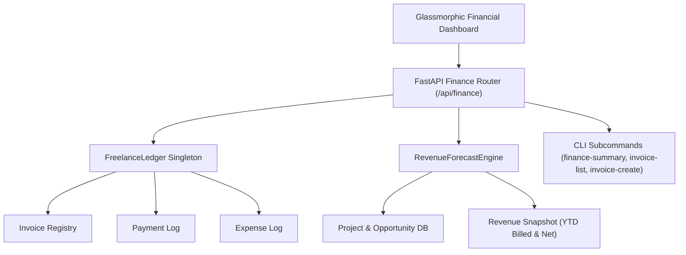

# Phase 24: AI-Powered Revenue Intelligence & Freelance Financial Dashboard

## Overview
Phase 24 introduces **Revenue Intelligence & Financial Dashboard** to `CLIENT FINDER SVC`. Designed specifically for freelancers, agency owners, and independent consultants, this module unites contract execution, opportunity pipelines, invoice creation, payment processing, expense management, Monte Carlo forward revenue forecasting, and quarterly tax reserve estimation into a single glassmorphic dashboard.

---

## Key Capabilities

1. **Freelance Invoicing Engine**
   - Itemized service breakdown with automatic subtotal, tax rate calculations, and discount percentages.
   - Status automation tracking across `DRAFT`, `SENT`, `VIEWED`, `PARTIALLY_PAID`, `PAID`, `OVERDUE`, `DISPUTED`, and `CANCELLED`.
   - Automatic overdue transition checks on invoice querying based on due date.

2. **Payment Ledger & AR Tracking**
   - Record single or split payments against active invoices with payment method tags (Bank Transfer, PayPal, Stripe, Wise, Crypto, Check).
   - Real-time updates to outstanding Accounts Receivable (AR) balances.

3. **Business Expense Management**
   - Categorized expense logging (Software, Hardware, Marketing, Education, Travel, Tax, Legal, Insurance, Misc).
   - Tax-deductibility flags for precise net income and tax reserve estimations.

4. **AI-Powered 90-Day Revenue Forecasting**
   - Blends weighted pipeline opportunity values (win probabilities derived from match scores capped at 95%) with historical baseline collections.
   - Outputs Expected, Conservative, and Optimistic forward revenue scenarios with month-by-month confidence decay.
   - Proactive cash flow alert triggers if conservative forecasts drop below baseline threshold.

5. **Quarterly Tax Reserve Advisor**
   - Computes net taxable profit (gross collected minus deductible expenses).
   - Applies customizable tax rates (default 28%) to compute estimated tax liability, existing reserve gaps, and recommended monthly savings targets.

---

## System Architecture

---

## API Endpoints Summary

| Method | Endpoint | Description |
| :--- | :--- | :--- |
| `GET` | `/api/finance/summary` | Get aggregated YTD KPIs, net profit, and tax reserve recommendation |
| `GET` | `/api/finance/invoices` | List invoices (optional `status_filter`) |
| `POST` | `/api/finance/invoices` | Issue a new freelance invoice |
| `PATCH` | `/api/finance/invoices/{id}/status` | Update invoice lifecycle state |
| `POST` | `/api/finance/invoices/{id}/payment` | Record full or partial payment |
| `GET` | `/api/finance/expenses` | List logged business expenses |
| `POST` | `/api/finance/expenses` | Log new expense item |
| `GET` | `/api/finance/forecast` | Generate 90-day forward revenue forecast |
| `GET` | `/api/finance/tax-reserve` | Get detailed tax reserve breakdown and monthly advisory |

---

## CLI Integration

- **Summary**: `python -m src.cli finance-summary [--tenant TENANT]`
- **List Invoices**: `python -m src.cli invoice-list [--tenant TENANT]`
- **Create Invoice**: `python -m src.cli invoice-create --client "Acme Corp" --description "FastAPI API Build" --amount 2500 --tax-rate 10 --due-days 14`

---

## Verification & Testing

- Unit test suite: `tests/unit/test_finance.py`
- Test coverage includes invoice math, partial payment status updates, expense deductions, Monte Carlo forecaster win probability decay, and REST API routes.
