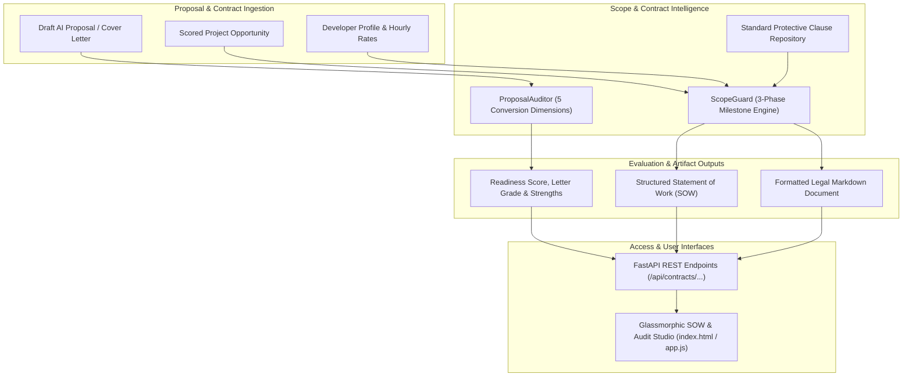

# Scope of Work (SOW) Generator, Protective Contract Guard & AI Proposal Auditor

## Executive Summary

This feature equips **CLIENT FINDER SVC** with enterprise-grade freelance contracting, milestone escrow scheduling, scope-creep prevention, and automated proposal conversion quality auditing:
1. **Scope of Work (SOW) Milestone Generator (`ScopeGuard`)**: Automatically translates unstructured opportunity requirements into a legally-sound, 3-phase milestone schedule (Phase 1 Discovery & Setup [30%], Phase 2 Core Implementation [40%], Phase 3 UAT & Production Handover [30%]) with concrete deliverables, objective acceptance criteria, and escrow release triggers.
2. **Protective Contractual Clause Sentinel**: Enforces standard protective clauses against scope creep (*Formal Change Order Protocol*), unreleased code liabilities (*IP Transfer Upon Full Payment*), client ghosting (*5-Day Review & Deemed Acceptance*), and delinquent payments (*1.5% Late Suspension*).
3. **AI Proposal Conversion Readiness Auditor (`ProposalAuditor`)**: Evaluates draft proposals across 5 vital commercial conversion dimensions (*Specificity & Diagnosis*, *Social Proof & Quantitative Metrics*, *Call to Action [CTA]*, *Brevity & Readability [80–260 words]*, and *Risk & Pricing Transparency*) and outputs an overall score, letter grade, detected strengths, and actionable improvement recommendations.
4. **SOW & Contract REST API**: Full endpoint suite mounted under `/api/contracts/...` for milestone synthesis, proposal auditing, and protective clause catalog retrieval.
5. **Interactive Glassmorphic Studio UI**: "📋 SOW & Audit" studio modal in the Web Dashboard with 1-click Markdown contract export and live proposal conversion audit cards.

---

## 1. SOW & Proposal Quality Architecture

---

## 2. Component Breakdown

### 2.1 Scope Guard & Milestone Engine (`src/proposal/scope_guard.py`)
- **Phased Milestone Escrow Allocation**:
  - **Phase 1 (30% Upfront Kickoff)**: Discovery, Architecture Blueprint, Database Schema, and Repository CI/CD environment initialization.
  - **Phase 2 (40% Core Delivery)**: Business logic implementation, database migrations, connection pooling, background workers, and staging demo verification.
  - **Phase 3 (30% Final Acceptance)**: Load testing, Swagger/OpenAPI documentation, user acceptance testing (UAT), and production deployment handover.
- **Protective Freelance Contract Clauses**:
  - `Scope Boundary & Change Orders`: Strictly bounds deliverables; additional feature requests require formal written Change Orders.
  - `IP Assignment Upon Full Payment`: Retains IP ownership with the contractor until final milestone payment clears.
  - `5-Day Review & Deemed Acceptance`: Eliminates client ghosting by automatically accepting milestone deliverables if no rejection notice is submitted within 5 business days.
  - `Late Payment & Suspension of Work`: Imposes a 1.5%/month penalty and pauses active deployments on overdue invoices.

### 2.2 Proposal Conversion & Quality Auditor (`src/proposal/auditor.py`)
- **5-Dimensional Conversion Audit**:
  1. **Specificity & Diagnosis (Weight: 25%)**: Verifies presence of target stack technologies and project title keywords.
  2. **Social Proof & Quantitative Metrics (Weight: 25%)**: Detects verified benchmark numbers (e.g. `45% latency reduction`, `50k DAU`, `3x throughput`) and case study citations.
  3. **Call to Action (CTA) (Weight: 20%)**: Checks for low-friction closing questions and calendar availability prompts.
  4. **Brevity & Readability (Weight: 15%)**: Evaluates word count against optimal commercial ranges ($80 \le \text{words} \le 260$).
  5. **Risk & Scope Transparency (Weight: 15%)**: Ensures milestone delivery phrases or transparent budget ranges are specified.
- **Scoring & Grading Scale**:
  - `88.0 - 100.0`: **EXCELLENT** (Ready for high-ticket direct outreach)
  - `75.0 - 87.9`: **STRONG** (Minor polish recommended)
  - `60.0 - 74.9`: **NEEDS_IMPROVEMENT** (Lacks specificity or quantitative proof)
  - `< 60.0`: **POOR** (High risk of looking generic or low-effort)

---

## 3. REST API Endpoint Reference Catalog

| Route Group | Method | Path | Description |
| :--- | :--- | :--- | :--- |
| **Contracts** | `POST` | `/api/contracts/generate-sow` | Synthesize complete Scope of Work (SOW) milestone schedule and Markdown contract |
| **Contracts** | `POST` | `/api/contracts/audit-proposal` | Audit draft proposal conversion readiness across 5 dimensions with actionable tips |
| **Contracts** | `GET` | `/api/contracts/clauses` | Retrieve standardized repository of protective freelance contract clauses |

---

## 4. Verification & Quality Assurance

- **Unit Tests**: Full coverage for milestone budget splitting, clause synthesis, specificity scoring, metric extraction, and API endpoints.
- **Code Quality**: 100% clean Ruff check and zero mypy typing errors.
