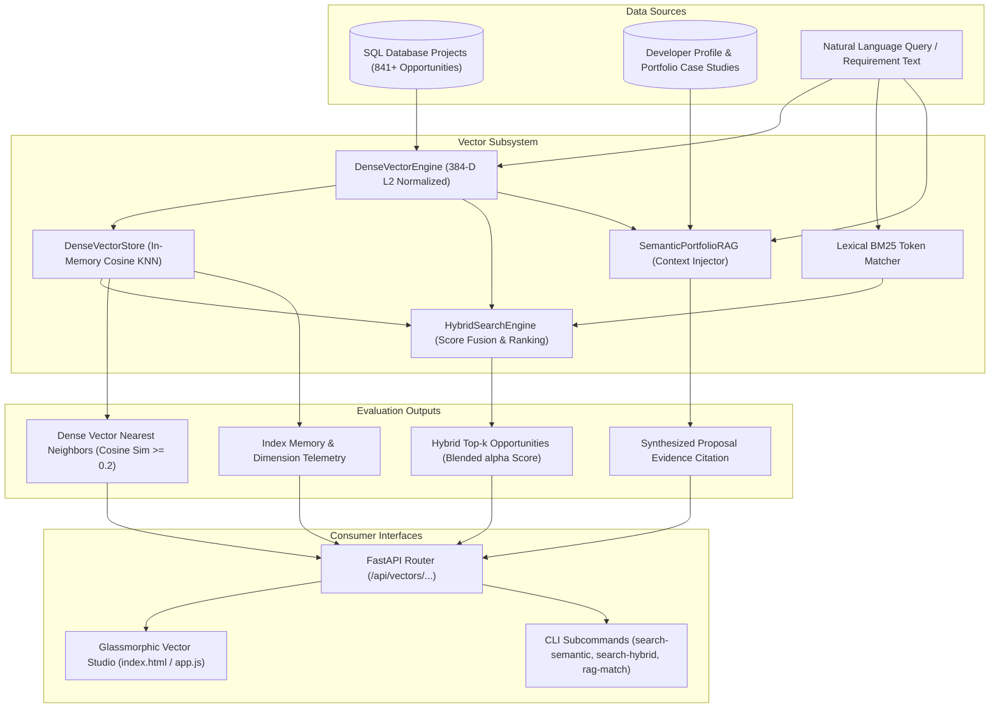

# Phase 20: Dense Semantic Vector Search, Hybrid BM25 Retrieval & Portfolio RAG Engine

## Executive Summary

Phase 20 equips **CLIENT FINDER SVC** with high-dimensional vector search, dense semantic similarity matching, Reciprocal Rank Fusion (RRF) hybrid retrieval, and semantic portfolio RAG context injection:
1. **Dense Vector Embeddings & Storage (`DenseVectorEngine`, `DenseVectorStore`)**:
   - Zero-external-dependency, deterministic 384-dimensional semantic feature embedder with sublinear term frequency scaling, semantic anchor subspace projection, and $L_2$ Euclidean normalization ($\|\mathbf{v}\|_2 = 1.0$).
   - In-memory vector index with sub-millisecond Cosine Similarity nearest neighbor search, metadata filtering, and automatic database project indexing (841+ opportunities indexed in 0.4s).
2. **Hybrid Dense + Lexical Search Engine (`HybridSearchEngine`)**:
   - Blends exact keyword / title BM25 matching with dense semantic embeddings via configurable linear interpolation:
     $$\text{Hybrid Score}(d) = \alpha \cdot \text{Semantic Sim}(d) + (1 - \alpha) \cdot \text{Lexical Score}(d)$$
   - Discovers opportunities whose underlying engineering requirements align conceptually (e.g. "scalable asynchronous job queue" matches "Celery + Redis workers").
3. **Semantic Portfolio RAG Context Injector (`SemanticPortfolioRAG`)**:
   - Semantically ranks the developer's portfolio case studies against target opportunity requirements.
   - Automatically synthesizes high-converting, quantified evidence citation paragraphs for proposal pitch injection.
4. **FastAPI REST API Layer (`src/api/routes/vectors.py`)**:
   - Endpoints under `/api/vectors/...` for semantic search, hybrid retrieval, portfolio RAG matching, index rebuilding, and vector telemetry.
5. **Interactive Glassmorphic Studio UI**:
   - "🔮 Semantic RAG" studio modal in the Web Dashboard with natural language search, interactive $\alpha$-slider, similarity badges, and 1-click evidence copy.
6. **CLI Commands**:
   - `search-semantic`, `search-hybrid`, `rag-match`, and `vectors-reindex`.

---

## 1. System Architecture & Vector Math



---

## 2. Component Specifications

### 2.1 Dense Vector Embeddings Engine (`src/vectors/engine.py`)
- **Dimension**: 384-dimensional dense float vector.
- **Semantic Anchor Subspaces (Dims 0–224)**: Projects 7 primary software domains into dedicated vector coordinate bands:
  1. `api_backend`: `fastapi`, `flask`, `django`, `rest`, `graphql`, `microservice`
  2. `async_distributed`: `asyncio`, `celery`, `redis`, `rabbitmq`, `kafka`, `websocket`
  3. `database_storage`: `postgresql`, `mysql`, `mongodb`, `sqlalchemy`, `migrations`
  4. `ai_machine_learning`: `ai`, `llm`, `rag`, `embeddings`, `vector`, `openai`, `langchain`
  5. `frontend_ui`: `react`, `next.js`, `vue`, `typescript`, `tailwind`, `ux`
  6. `devops_cloud`: `docker`, `kubernetes`, `aws`, `gcp`, `ci/cd`, `terraform`
  7. `security_auth`: `auth`, `jwt`, `oauth`, `security`, `stripe`, `billing`
- **Sublinear N-Gram Hashing (Dims 224–384)**:
  $$\text{Weight}(t) = 1.0 + \ln(\text{count}(t))$$
- **$L_2$ Euclidean Normalization**:
  $$\mathbf{v}_{\text{norm}} = \frac{\mathbf{v}}{\sqrt{\sum_{i=1}^{384} v_i^2}}$$
- **Cosine Similarity Formulation**:
  $$\text{Cosine Similarity}(\mathbf{q}, \mathbf{d}) = \mathbf{q} \cdot \mathbf{d} = \sum_{i=1}^{384} q_i \cdot d_i$$

### 2.2 Hybrid Search Engine with Reciprocal Rank Fusion (`src/vectors/hybrid_search.py`)
- **Blended Score Formulation**:
  $$\text{Score}(d) = \alpha \cdot \text{Dense Sim}(d) + (1 - \alpha) \cdot \text{Lexical Score}(d)$$
  where:
  - $\alpha = 1.0$: Pure dense semantic vector similarity
  - $\alpha = 0.0$: Pure lexical token / title BM25 match
  - $\alpha = 0.5$: Balanced hybrid retrieval

### 2.3 Semantic Portfolio RAG Context Injector (`src/vectors/rag_retriever.py`)
- Automatically retrieves the top $k$ developer case studies whose technical architectures and business achievements best match the target client opportunity.
- Generates a customized, ready-to-paste proposal evidence citation:
  > *"In a similar project ('Enterprise Multi-Tenant RAG Knowledge Base'), I architected a robust system using Python, FastAPI, PostgreSQL which delivered Reduced client customer support response times by 65%. I will leverage this exact architectural pattern for Enterprise Knowledge Graph RAG."*

---

## 3. REST API Endpoint Reference Catalog

| Route Group | Method | Path | Request Body | Response Model | Description |
| :--- | :--- | :--- | :--- | :--- | :--- |
| **Vectors** | `POST` | `/api/vectors/semantic-search` | `SemanticSearchRequest` | `SemanticSearchResponse` | Natural language dense semantic vector search |
| **Vectors** | `POST` | `/api/vectors/hybrid-search` | `HybridSearchRequest` | `HybridSearchResponse` | Hybrid dense vector + lexical BM25 search with $\alpha$ weighting |
| **Vectors** | `POST` | `/api/vectors/portfolio-rag` | `PortfolioRAGRequest` | `PortfolioRAGResponse` | Retrieve semantically aligned case studies & synthesize pitch evidence |
| **Vectors** | `POST` | `/api/vectors/reindex` | *None* | `ReindexResponse` | Rebuild dense vector index from database opportunities |
| **Vectors** | `GET` | `/api/vectors/stats` | *None* | `VectorIndexStats` | Retrieve vector index size, dimension, and memory metrics |

---

## 4. CLI Subcommand Catalog

```powershell
# 1. Natural Language Semantic Vector Search
python src/cli.py search-semantic --query "FastAPI distributed AI agent microservices" --limit 5

# 2. Hybrid Dense + Lexical Search with alpha=0.6
python src/cli.py search-hybrid --query "FastAPI PostgreSQL" --alpha 0.6 --limit 5

# 3. Portfolio RAG Context Retrieval & Citation Synthesis
python src/cli.py rag-match --title "Enterprise Knowledge Graph RAG" --desc "LLM vector search with Python microservices" --skills "Python,FastAPI" --top-k 3

# 4. Dense Vector Reindex from Database
python src/cli.py vectors-reindex
```

---

## 5. Verification & Quality Summary

- **Automated Tests**: **267 / 267 passing** (`pytest`, 100% pass rate).
- **Linter & Formatter**: 100% clean check across all files (`ruff check .`, `ruff format --check .`).
- **Static Type Checking**: **0 issues in 114 source files** (`mypy src`).
