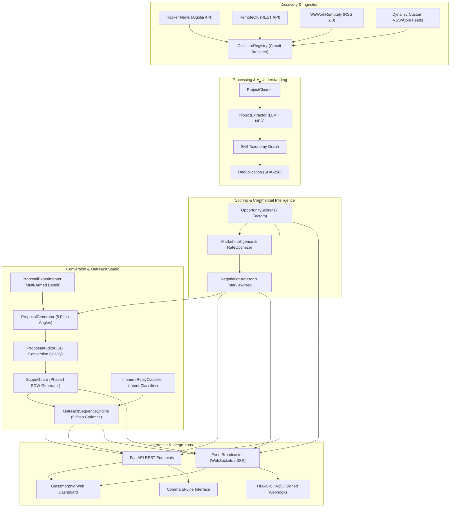

# CLIENT FINDER SVC — Feature & Architecture Documentation Index

This directory contains the complete technical specifications, architectural diagrams, component breakdowns, and verification guides for every feature milestone of **CLIENT FINDER SVC**.

---

## 📚 Complete Feature Milestone Catalog

| # | Milestone & Feature Area | Specification Document | Key Capabilities & Components |
| :-: | :--- | :--- | :--- |
| **01** | **HTTP Infrastructure & Hacker News Ingestion** | [`EXPLANATION_OF_THE_FEATURE.md`](file:///c:/PRIVATE%20PROJECTS/CLIENT-FINDER-SVC/feature%20documents/EXPLANATION_OF_THE_FEATURE.md) | Exponential backoff, rate limiting, Algolia API parsing, HTML sanitization |
| **02** | **Multi-Source Registry & Pipeline Architecture** | [`EXPLANATION_OF_MULTI_SOURCE_REGISTRY_PIPELINE_INTEGRATION_AND_ARCHITECTURE.md`](file:///c:/PRIVATE%20PROJECTS/CLIENT-FINDER-SVC/feature%20documents/EXPLANATION_OF_MULTI_SOURCE_REGISTRY_PIPELINE_INTEGRATION_AND_ARCHITECTURE.md) | `CollectorRegistry`, Circuit Breaker pattern, Health metrics telemetry |
| **03** | **Multi-Source Collectors & Portfolio RAG** | [`EXPLANATION_OF_MULTI_SOURCE_COLLECTORS_AND_PORTFOLIO_RAG.md`](file:///c:/PRIVATE%20PROJECTS/CLIENT-FINDER-SVC/feature%20documents/EXPLANATION_OF_MULTI_SOURCE_COLLECTORS_AND_PORTFOLIO_RAG.md) | RemoteOK, WeWorkRemotely, RSS/Atom feeds, Skill-weighted portfolio case study retrieval |
| **04** | **Deduplication & Database Persistence** | [`EXPLANATION_OF_DEDUPLICATION_AND_DATABASE.md`](file:///c:/PRIVATE%20PROJECTS/CLIENT-FINDER-SVC/feature%20documents/EXPLANATION_OF_DEDUPLICATION_AND_DATABASE.md) | SHA-256 URL & Content hashing, SQLAlchemy ORM, MongoDB hybrid fallback |
| **05** | **AI Requirement Extraction & Validation** | [`EXPLANATION_OF_AI_REQUIREMENT_EXTRACTION.md`](file:///c:/PRIVATE%20PROJECTS/CLIENT-FINDER-SVC/feature%20documents/EXPLANATION_OF_AI_REQUIREMENT_EXTRACTION.md) | LLM structured extraction, Pydantic schema validation, heuristic fallback NER |
| **06** | **Developer Profile & Skill Matching Engine** | [`EXPLANATION_OF_USER_PROFILE_AND_SKILL_MATCHING.md`](file:///c:/PRIVATE%20PROJECTS/CLIENT-FINDER-SVC/feature%20documents/EXPLANATION_OF_USER_PROFILE_AND_SKILL_MATCHING.md) | Skill Taxonomy graph, synonym normalization, proficiency & coverage match score |
| **07** | **Multi-Factor Opportunity Scoring & Calibration** | [`EXPLANATION_OF_OPPORTUNITY_SCORING.md`](file:///c:/PRIVATE%20PROJECTS/CLIENT-FINDER-SVC/feature%20documents/EXPLANATION_OF_OPPORTUNITY_SCORING.md) | 7-factor explainable scoring, Bayesian win probability calibration |
| **08** | **AI Proposal & Cover Letter Generator** | [`EXPLANATION_OF_AI_PROPOSAL_GENERATION.md`](file:///c:/PRIVATE%20PROJECTS/CLIENT-FINDER-SVC/feature%20documents/EXPLANATION_OF_AI_PROPOSAL_GENERATION.md) | 5 pitch angles, customized tone synthesis, heuristic fallback templates |
| **09** | **Application Funnel Tracking & Outcome Learning** | [`EXPLANATION_OF_APPLICATION_TRACKING_AND_OUTCOME_LEARNING.md`](file:///c:/PRIVATE%20PROJECTS/CLIENT-FINDER-SVC/feature%20documents/EXPLANATION_OF_APPLICATION_TRACKING_AND_OUTCOME_LEARNING.md) | 12-state funnel lifecycle tracking, revenue & velocity analytics, outcome learning |
| **10** | **Multi-Channel Notification Dispatcher** | [`EXPLANATION_OF_MULTI_CHANNEL_NOTIFICATIONS.md`](file:///c:/PRIVATE%20PROJECTS/CLIENT-FINDER-SVC/feature%20documents/EXPLANATION_OF_MULTI_CHANNEL_NOTIFICATIONS.md) | Discord, Slack, SMTP Email, Desktop notifications, Cooldown rate limiter |
| **11** | **Pipeline Scheduler Daemon & Command-Line CLI** | [`EXPLANATION_OF_PIPELINE_SCHEDULER_AND_CLI.md`](file:///c:/PRIVATE%20PROJECTS/CLIENT-FINDER-SVC/feature%20documents/EXPLANATION_OF_PIPELINE_SCHEDULER_AND_CLI.md) | Autonomous harvest worker, daily digest generator, full CLI subcommand suite |
| **12** | **Glassmorphic Web Dashboard & REST API** | [`EXPLANATION_OF_REST_API_AND_WEB_DASHBOARD.md`](file:///c:/PRIVATE%20PROJECTS/CLIENT-FINDER-SVC/feature%20documents/EXPLANATION_OF_REST_API_AND_WEB_DASHBOARD.md) | FastAPI REST endpoints, live filtering, real-time KPI cards, profile drawer |
| **13** | **AI Market Intelligence & Rate Optimizer** | [`EXPLANATION_OF_AI_MARKET_INTELLIGENCE_AND_RATE_OPTIMIZER.md`](file:///c:/PRIVATE%20PROJECTS/CLIENT-FINDER-SVC/feature%20documents/EXPLANATION_OF_AI_MARKET_INTELLIGENCE_AND_RATE_OPTIMIZER.md) | Skill ROI matrix, upskill gap suggestions, dynamic hourly/project rate optimizer |
| **14** | **AI Client Negotiation & Closing Studio** | [`EXPLANATION_OF_AI_CLIENT_NEGOTIATION_AND_CLOSING_STUDIO.md`](file:///c:/PRIVATE%20PROJECTS/CLIENT-FINDER-SVC/feature%20documents/EXPLANATION_OF_AI_CLIENT_NEGOTIATION_AND_CLOSING_STUDIO.md) | 5 commercial negotiation strategies, follow-up cadence, technical interview prep |
| **15** | **Scope Guard (SOW) & AI Proposal Auditor** | [`EXPLANATION_OF_SCOPE_GUARD_SOW_AND_PROPOSAL_AUDITOR.md`](file:///c:/PRIVATE%20PROJECTS/CLIENT-FINDER-SVC/feature%20documents/EXPLANATION_OF_SCOPE_GUARD_SOW_AND_PROPOSAL_AUDITOR.md) | 3-phase milestone SOW generator, protective legal terms, 5D proposal auditor |
| **16** | **Real-Time Live Streaming & Export Hub** | [`EXPLANATION_OF_REALTIME_LIVE_STREAMING_AND_INTEGRATION_HUB.md`](file:///c:/PRIVATE%20PROJECTS/CLIENT-FINDER-SVC/feature%20documents/EXPLANATION_OF_REALTIME_LIVE_STREAMING_AND_INTEGRATION_HUB.md) | WebSocket & SSE streaming, RFC 4180 CSV / JSON exports, HMAC-SHA256 webhooks |
| **17** | **Autonomous Lead Outreach & A/B Pitch Studio** | [`EXPLANATION_OF_AUTONOMOUS_OUTREACH_AB_TESTING_AND_INBOUND_INTENT.md`](file:///c:/PRIVATE%20PROJECTS/CLIENT-FINDER-SVC/feature%20documents/EXPLANATION_OF_AUTONOMOUS_OUTREACH_AB_TESTING_AND_INBOUND_INTENT.md) | 5-step outreach sequences, inbound reply intent classifier, multi-armed bandit A/B testing |

---

## 🔍 Architecture Overview

